```{r setup, include=FALSE}
knitr::opts_chunk$set(echo = TRUE)
library(rmarkdown)
library(knitr)
library(kableExtra)
```


# Presentación


# Gráficas

## Gráficas Generales


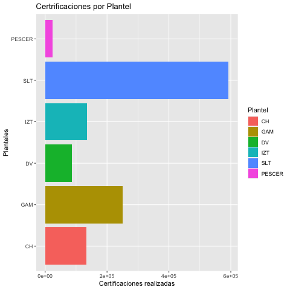


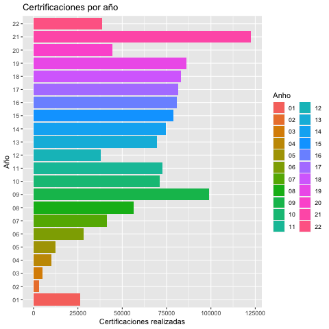

## Gráficas de Certificaciones por Planteles


## Graficas de Certificaciones por Año


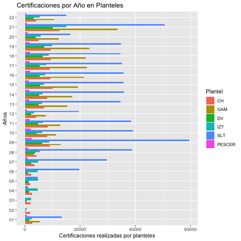


## Graficas de Certificaciones por Generacion


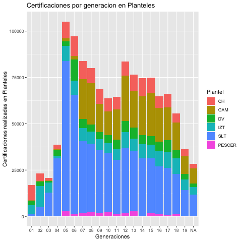


## Gráficas de certificaciones relacionadas con Licenciaturas

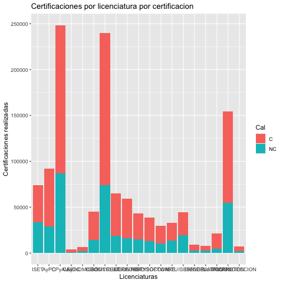


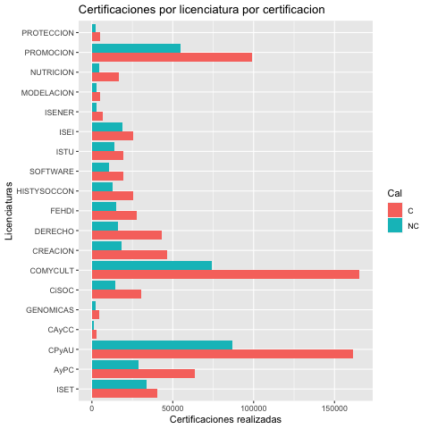


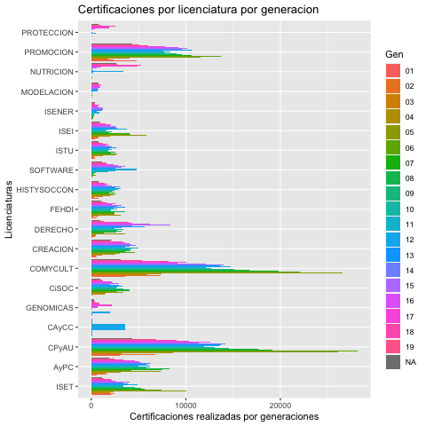


## Gráficas de Certificacines por Materias


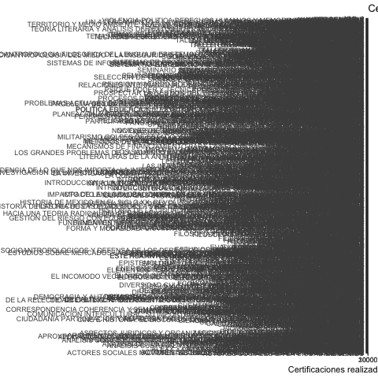


## Graficas de certificaciones por Plantel


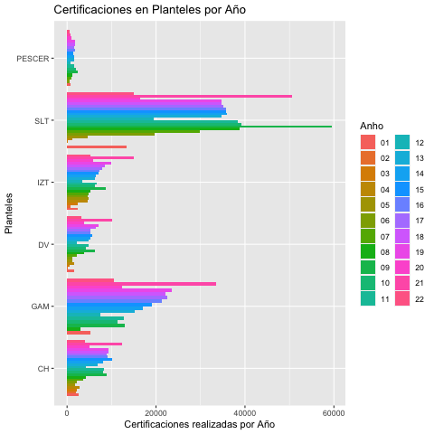


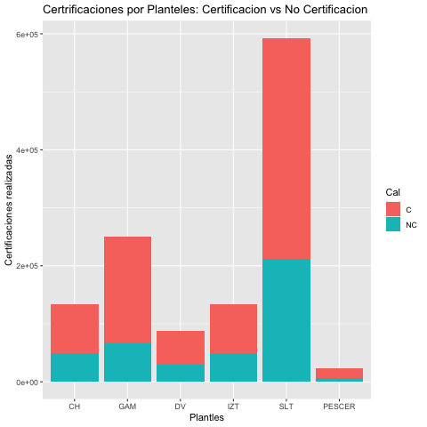


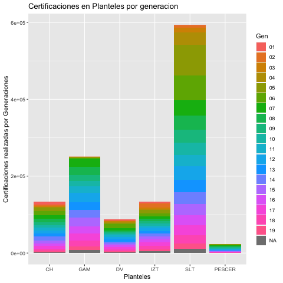


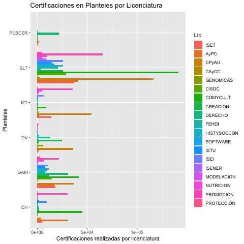


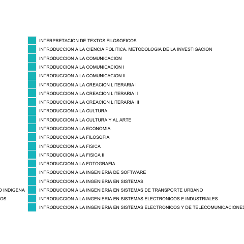


## Listado

```{r}
## 1                     BarPlotLic.png ya
## 2              BarplotPlantelCal.png ya
## 3               barplotPlanteles.png ya
## 4              BarplotPlantelGen.png ya
## 5              BarplotPlantelLic.png ya
## 6              ggplotBarplotAnho.png ya
## 7           ggplotBarplotAnhoLic.png ya
## 8          ggplotBarplotAnhoLic2.png ya
## 9      ggplotBarplotAnhoMaterias.png ya
## 10    ggplotBarplotAnhoMaterias2.png ya
## 11      ggplotBarplotAnhoPlantel.png ya
## 12     ggplotBarplotAnhoPlantel2.png ya
## 13     ggplotBarplotAnhoPlantel3.png ya
## 14           ggplotBarplotGenLic.png ya
## 15          ggplotBarplotGenLic2.png ya
## 16      ggplotBarplotGenMaterias.png ya
## 17       ggplotBarplotGenPlantel.png ya
## 18      ggplotBarplotGenPlantel2.png ya
## 19              ggplotBarplotLic.png ya
## 20           ggplotBarplotLicCal.png ya
## 21          ggplotBarplotLicCal2.png ya
## 22           ggplotBarplotLicGen.png ya
## 23          ggplotBarplotLicGen2.png ya
## 24       ggplotBarplotLicPlantel.png ya
## 25      ggplotBarplotLicPlantel2.png ya
## 26  ggplotBarplotMateriasPlantel.png ya
## 27 ggplotBarplotMateriasPlantel2.png ya
## 28 ggplotBarplotMateriasPlantel3.png ya
## 29      ggplotBarplotPlantelAnho.png ya
## 30       ggplotBarplotPlantelCal.png ya
## 31      ggplotBarplotPlantelCal2.png ya
## 32      ggplotBarplotPlantelCal3.png ya
## 33        ggplotBarplotPlanteles.png ya
## 34      ggplotBarplotPlantelGen3.png ya
## 35      ggplotBarplotPlantelGen4.png ya 
## 36       ggplotBarplotPlantelLic.png ya
## 37      ggplotBarplotPlantelLic2.png ya
## 38      ggplotBarplotPlantelLic3.png ya
## 39  ggplotBarplotPlantelMaterias.png ya
## 40 ggplotBarplotPlantelMaterias2.png ya 
## 41 ggplotBarplotPlantelMaterias3.png ya
```

# Tablas


```{r, echo=FALSE}


# Crear los datos
data <- data.frame(
  Año1 = c(01, 02, 03, 04, 05, 06, 07, 08, 09, 10, 11),
  Cantidad1 = c(26173, 2927, 5109, 10144, 12565, 28147, 41332, 56299, 99032, 71193, 72554),
  Año2 = c(12, 13, 14, 15, 16, 17, 18, 19, 20, 21, 22),
  Cantidad2 = c(3774, 69575, 74449, 78721, 80783, 81429, 82974, 86330, 44395, 122594, 38627)
)

# Crear la tabla
tabla <- kable(data, "latex", booktabs = TRUE, caption = "\\label{CertificacionesAnual}Número de certificaciones por año en toda la Universidad.") %>%
  kable_styling(latex_options = c("striped", "hold_position"), full_width = FALSE) %>%
  column_spec(1, bold = TRUE) %>%
  column_spec(3, bold = TRUE)

tabla  # Despliega la tabla en el documento
```


```{r, echo=FALSE}
# Datos de la tabla
datos1 <- data.frame(
  Planteles = c("CH", "GAM", "DV", "IZT", "SLT", "PESCER"),
  `01` = c(8263, 146, 2321, 4707, 1430, 0),
  `02` = c(4132, 326, 2328, 11398, 5101, 0),
  `03` = c(1235, 241, 1006, 5370, 12801, 0),
  `04` = c(2173, 697, 3130, 1191, 31416, 0),
  `05` = c(9193, 1476, 2647, 8157, 80933, 2794),
  `06` = c(10566, 1852, 11588, 7523, 64603, 1029),
  `07` = c(9718, 21549, 4843, 7076, 38846, 1844),
  `08` = c(8183, 22348, 3749, 6545, 36801, 2399),
  `09` = c(7756, 15305, 3881, 5612, 33917, 2020),
  `10` = c(7005, 12963, 4311, 5406, 31698, 2342)
)

datos2 <- data.frame(
  Planteles = c("CH", "GAM", "DV", "IZT", "SLT", "PESCER"),
  `11` = c(6653, 16435, 5044, 5656, 29265, 1368),
  `12` = c(7688, 24588, 5988, 8342, 35439, 1615),
  `13` = c(8749, 19903, 6007, 6911, 32264, 2750),
  `14` = c(9753, 20987, 4963, 7590, 31143, 217),
  `15` = c(8400, 23058, 4558, 7571, 29166, 2071),
  `16` = c(6383, 18276, 5165, 8166, 25932, 1011),
  `17` = c(7120, 17947, 6180, 8601, 25392, 825),
  `18` = c(4928, 14830, 4321, 8548, 21391, 1474),
  `19` = c(3727, 9678, 2962, 5775, 13907, 206)
)

# Generar la tabla 01-10
cat("### Tabla 01-10\n")
knitr::kable(datos1, format = "markdown", booktabs = TRUE, caption = "\\label{CertificacionesAnualPlanteles01-10}Número de certificaciones por año por planteles en toda la Universidad (01-10).")

# Generar la tabla 11-19
cat("### Tabla 11-19\n")
knitr::kable(datos2, format = "markdown", booktabs = TRUE, caption = "\\label{CertificacionesAnualPlanteles11-19}Número de certificaciones por año por planteles en toda la Universidad (11-19).")

```


# Tablas 2


\begin{table}[ht]
\centering
\begin{tabular}{||r||r||r|r||}\hline
\multicolumn{4}{|c|}{Certificaciones} \\\hline
Año  & Cantidad  & Año  & Cantidad  \\\hline
01 & 26173& 12 & 3774 \\ 
  02 & 2927 &13 & 69575  \\ 
  03 & 5109 & 14 & 74449\\ 
  04 & 10144 & 15 & 78721\\ 
  05 & 12565 &16 & 80783 \\ 
  06 & 28147 &17 & 81429\\ 
  07 & 41332 &18 & 82974\\ 
  08 & 56299 &19 & 86330\\ 
  09 & 99032 &20 & 44395\\ 
  10 & 71193 &21 & 122594 \\ 
  11 & 72554 &22 & 38627\\
\hline
\end{tabular}
\caption{\label{CertificacionesAnual}n\'umero de certificaciones por a\~no en toda la Universidad.}
\end{table}


\begin{table}[ht]
\centering
\begin{tabular}{rrrrrrrrrrr}
  \hline
 & 01 & 02 & 03 & 04 & 05 & 06 & 07 & 08 & 09 & 10 \\ 
  \hline
CH & 8263 & 4132 & 1235 & 2173 & 9193 & 10566 & 9718 & 8183 & 7756 & 7005 \\ 
  GAM & 146 & 326 & 241 & 697 & 1476 & 1852 & 21549 & 22348 & 15305 & 12963  \\ 
  DV & 2321 & 2328 & 1006 & 3130 & 2647 & 11588 & 4843 & 3749 & 3881 & 4311\\ 
  IZT & 4707 & 11398 & 5370 & 1191 & 8157 & 7523 & 7076 & 6545 & 5612 & 5406\\ 
  SLT & 1430 & 5101 & 12801 & 31416 & 80933 & 64603 & 38846 & 36801 & 33917 & 31698\\ 
  PESCER &   0 &   0 &   0 &   0 & 2794 & 1029 & 1844 & 2399 & 2020 & 2342\\ 
   \hline
  \hline
 &  11 & 12 & 13 & 14 & 15 & 16 & 17 & 18 & 19 \\ 
  \hline
CH & 6653 & 7688 & 8749 & 9753 & 8400 & 6383 & 7120 & 4928 & 3727 \\ 
  GAM &  16435 & 24588 & 19903 & 20987 & 23058 & 18276 & 17947 & 14830 & 9678 \\ 
  DV &  5044 & 5988 & 6007 & 4963 & 4558 & 5165 & 6180 & 4321 & 2962 \\ 
  IZT &  5656 & 8342 & 6911 & 7590 & 7571 & 8166 & 8601 & 8548 & 5775 \\ 
  SLT &  29265 & 35439 & 32264 & 31143 & 29166 & 25932 & 25392 & 21391 & 13907 \\ 
  PESCER & 1368 & 1615 & 2750 & 217 & 2071 & 1011 & 825 & 1474 & 206 \\ 
   \hline
\end{tabular}
\caption{\label{CertificacionesAnualPlanteles}n\'umero de certificaciones por a\~no por planteles en toda la Universidad.}
\end{table}


\begin{table}[ht]
\centering
\begin{tabular}{rrrrrr}
  \hline
 & ISET & AyPC & CPyAU & CAyCC & GENOMICAS \\ 
  \hline
CH & 4628 & 30861 & 3875 &   6 & 166 \\ 
GAM & 18211 & 17043 & 36315 &  15 & 119 \\ 
DV &  93 & 1065 & 36016 &  76 & 5886 \\ 
IZT & 14183 & 1988 & 54457 & 1465 &  62 \\ 
SLT & 36856 & 41305 & 116407 & 2238 & 460 \\ 
PESCER &  29 &  38 & 1436 &   0 &   0 \\ 
   \hline
  \hline
 & CiSOC & COMYCULT & CREACION & DERECHO & FEHDI  \\ 
  \hline
CH &  588 & 45230 & 1966 & 1805 & 1151  \\ 
  GAM & 14410 & 42077 & 11903 & 30905 & 7957  \\ 
  DV & 206 & 1413 & 24891 & 611 & 12888\\ 
  IZT &  588 & 9207 & 288 & 1011 & 421 \\ 
  SLT & 29077 & 141630 & 25837 & 3095 & 20571  \\ 
  PESCER &  0 & 113 & 383 & 21794 &  61\\ 
   \hline
     \hline
 &  HISTYSOCCON & SOFTWARE & ISTU & ISEI & ISENER  \\ 
  \hline
CH & 884 & 618 & 9672 & 1772 & 236 \\ 
  GAM &  9658 & 11688 & 7889 & 10348 & 160  \\ 
  DV &   2018 &  84 &  42 & 166 &  59  \\ 
  IZT & 1339 & 550 & 626 & 6625 & 205 \\ 
  SLT &  25619 & 16902 & 14664 & 25524 & 8701  \\ 
  PESCER &   0 &  33 &   5 &  21 &   0 \\ 
   \hline
  \hline
 &  MODELACION & NUTRICION & PROMOCION & PROTECCION \\ 
  \hline
CH & 142 & 211 & 30101 & 126 \\ 
  GAM &  827 & 6585 & 21931 & 2600 \\ 
  DV &  61 & 234 & 1158 &  16 \\ 
  IZT &  1888 & 5028 & 35379 &  95 \\ 
  SLT &  4698 & 9378 & 65514 & 4584 \\ 
  PESCER  &  28 &   0 &  24 &   0 \\ 
   \hline
  \hline
\end{tabular}
\caption{Certificación por Licenciaturas en Planteles}
\end{table}


\begin{table}[ht!]
\centering
\scalebox{0.75}[.85]{
\begin{tabular}{rrr}
  \hline
 & C & NC \\ 
  \hline
CH & 84316 & 49722 \\ 
  GAM & 184212 & 66429 \\ 
  DV & 57100 & 29883 \\ 
  IZT & 84764 & 49641 \\ 
  SLT & 381135 & 211925 \\ 
  PESCER & 16854 & 7111 \\ 
   \hline
\end{tabular}}
\caption{\label{Prob_Cert_Plantel}Certificaciones en cada uno de los planteles}
\end{table}


\begin{table}[ht]
\centering
\scalebox{0.75}[.85]{
\begin{tabular}{rrrrrrr}
  \hline
 & CH & GAM & DV & IZT & SLT & PESCER \\ 
  \hline
01 & 8263 & 146 & 2321 & 4707 & 1430 &   0 \\ 
  02 & 4132 & 326 & 2328 & 11398 & 5101 &   0 \\ 
  03 & 1235 & 241 & 1006 & 5370 & 12801 &   0 \\ 
  04 & 2173 & 697 & 3130 & 1191 & 31416 &   0 \\ 
  05 & 9193 & 1476 & 2647 & 8157 & 80933 & 2794 \\ 
  06 & 10566 & 1852 & 11588 & 7523 & 64603 & 1029 \\ 
  07 & 9718 & 21549 & 4843 & 7076 & 38846 & 1844 \\ 
  08 & 8183 & 22348 & 3749 & 6545 & 36801 & 2399 \\ 
  09 & 7756 & 15305 & 3881 & 5612 & 33917 & 2020 \\ 
  10 & 7005 & 12963 & 4311 & 5406 & 31698 & 2342 \\ 
  11 & 6653 & 16435 & 5044 & 5656 & 29265 & 1368 \\ 
  12 & 7688 & 24588 & 5988 & 8342 & 35439 & 1615 \\ 
  13 & 8749 & 19903 & 6007 & 6911 & 32264 & 2750 \\ 
  14 & 9753 & 20987 & 4963 & 7590 & 31143 & 217 \\ 
  15 & 8400 & 23058 & 4558 & 7571 & 29166 & 2071 \\ 
  16 & 6383 & 18276 & 5165 & 8166 & 25932 & 1011 \\ 
  17 & 7120 & 17947 & 6180 & 8601 & 25392 & 825 \\ 
  18 & 4928 & 14830 & 4321 & 8548 & 21391 & 1474 \\ 
  19 & 3727 & 9678 & 2962 & 5775 & 13907 & 206 \\ 
   \hline
\end{tabular}}
\caption{\label{Cert_Gen_Plantel}Certificaci\'on en planteles por generaci\'on.}
\end{table}


\begin{table}[ht!]
\centering
\scalebox{0.75}[.85]{
\begin{tabular}{rr}
  \hline
 & V1 \\ 
  \hline
CH & 134038 \\ 
  GAM & 250641 \\ 
  DV & 86983 \\ 
  IZT & 134405 \\ 
  SLT & 593060 \\ 
  PESCER & 23965 \\ 
   \hline
\end{tabular}
}
\caption{\label{Prob_Cert_Intento_1}Probabilidad de certificar en el primer intento.}
\end{table}

\begin{table}[ht]
\centering
\scalebox{0.75}[.75]{
\begin{tabular}{||c||rrrrrr||rrrrrr||}
\hline\hline
\multicolumn{1}{||c||}{\multirow{3}{*}{AÑO}} & \multicolumn{12}{c||}{Certificaciones}                                                                                                                                                                                                                                                                                               \\ \cline{2-13} 
\multicolumn{1}{||c||}{}& \multicolumn{6}{c||}{Favorables}                                                                                                                                  & \multicolumn{6}{c||}{No Favorables}                                                                                                                               \\ \cline{2-13} 
\multicolumn{1}{||c||}{}& \multicolumn{1}{l|}{CH} & \multicolumn{1}{l|}{GAM} & \multicolumn{1}{l|}{DV} & \multicolumn{1}{l|}{IZT} & \multicolumn{1}{l|}{SLT} & \multicolumn{1}{l||}{PESCER} & \multicolumn{1}{l|}{CH} & \multicolumn{1}{l|}{GAM} & \multicolumn{1}{l|}{DV} & \multicolumn{1}{l|}{IZT} & \multicolumn{1}{l|}{SLT} & \multicolumn{1}{l||}{PESCER} \\ \hline
01 &  1709 & 3950 & 1046 & 1636 & 9562 & 498&  980 & 1388 &  557 &  826 & 3752  &  269\\
  02 & 466 & 0 & 114 & 258 & 2 & 0& 1510 &    0  & 120 &  448 &    9  &    0\\
  03 & 1051 & 0 & 426 & 1347 & 48 & 0 & 1062 &    0  & 159 &  996 &   20  &    0\\
  04 & 1493 & 0 & 1234 & 2164 & 656 & 0& 1222 &    0  & 289 & 2548 &  538  &    0\\
  05 & 896 & 0 & 814 & 2340 & 2299 & 0&  939 &    0  & 465 & 2503 & 2309  &    0\\
  06 & 1075 & 0 & 646 & 2287 & 8854 & 343& 1195 &    0  & 494 & 2325 &10799  &  129\\
  07 & 1482 & 0 & 1336 & 2391 & 13483 & 614& 2076 &    0  & 921 & 2404 &16304  &  321\\
  08 & 1914 & 1622 & 1903 & 2706 & 18035 & 813& 2300 & 1474 & 1866 & 2598 &20715  &  353\\
  09 & 4447 & 6951&3302&  4559 &30956 &  1727& 4528 & 6086 & 2925 & 4222 &28648   &681\\
  10 & 4204 & 7147 & 2585 & 3534& 22883 &  1505& 3851 & 4267 & 1708 & 2716 &16299  &  494\\
  11 & 4850 & 8846 & 2716 & 4179& 25113 &  1112& 3395 & 3976 & 2098 & 2416 &13310  &  543\\
  12 & 2501 & 5264 & 1454 & 2232& 13004  &  510& 1670 & 2279 &  786 & 1185 & 6532  &  323\\
  13 & 4493 &10846 & 3260 & 4031& 24282  & 1071& 2459 & 4449 & 1658 & 2255 &10347  &  424\\
  14 & 5345 &12594 & 3377 & 4153& 24967  & 1153& 2725 & 4519 & 1890 & 2332 &11015  &  379\\
  15 & 6242 &14426 & 3725 & 4557& 25280  & 1055& 3787 & 4667 & 1853 & 2428 &10370  &  331\\
  16 & 6111 &16010 & 3593 & 4872& 25648  & 1417& 2999 & 5349 & 1713 & 2494 &10170  &  407\\
  17 & 6225 &16896 & 3700 & 5320& 24879  & 1346& 2710 & 5607 & 1623 & 2487 &10312  &  324\\
  18 & 6686 &17182 & 4496 & 5854& 24555  & 1432& 2596 & 4997 & 1932 & 2712 &10105  &  427\\
  19 & 6950 &18591 & 5026 & 6946& 25053  & 1384& 2424 & 4863 & 2007 & 2999 & 9745  &  342\\
  20 & 3487 & 9168 & 2559 & 4015& 11794  &  322& 1470 & 3183 & 1333 & 1774 & 4684  &  606\\
  21 & 9585 &26384 & 7514 &11323& 38172  &  248& 2873 & 7111 & 2623 & 3689 &12502  &  570\\
  22 & 3104 & 8335 & 2274 & 4060& 11610  &  304&  951 & 2214 &  863 & 1284 & 3440  &  188\\\hline\hline
\end{tabular}}
\caption{Numero de certificaciones por a\~no en cada uno de los planteles de la universidad}
\label{Tabla_Certificaciones_Plantel_Anho}
\end{table}


\begin{table}[ht!]
\centering
\scalebox{0.75}[.85]{
\begin{tabular}{lrrrrrrrrrr}
  \hline\hline
Licenciatura & 01 & 02 & 03 & 04 & 05 & 06 & 07 & 08 & 09 & 10\\ 
  \hline
ISET & 2049 & 2419 & 1948 & 2392 & 10023 & 7398 & 5667 & 5259 & 4571 & 3414 \\ 
  AyPC & 609 & 1689 & 1551 & 3076 & 7340 & 4206 & 7513 & 8282 & 5824 & 6238\\ 
  CPyAU & 3032 & 6797 & 3248 & 8669 & 26126 & 28141 & 19151 & 17680 & 14577 & 13071\\ 
  CAyCC &   0 &   0 &   0 &   0 &   0 &   0 &   0 &   0 &   0 &   0\\ 
  GENOMICAS &   0 &   0 &   0 &   0 &   0 &   0 &   0 &   0 &   0 &  50\\ 
  CiSOC &  14 & 122 & 1464 & 1542 & 3352 & 2761 & 4017 & 4070 & 3364 & 2655\\ 
  COMYCULT & 3605 & 7303 & 5908 & 7418 & 26558 & 22101 & 19832 & 16680 & 15086 & 12666\\ 
  CREACION & 555 & 518 & 1158 & 2567 & 3062 & 4595 & 3586 & 4146 & 4088 & 4235\\ 
  DERECHO &  69 & 372 & 496 & 438 & 3562 & 1367 & 2642 & 3214 & 2765 & 3434\\ 
  FEHDI & 603 & 228 & 807 & 3095 & 2469 & 2495 & 2433 & 3534 & 2091 & 2065\\ 
  HISTYSOCCON & 772 & 341 & 1241 & 1998 & 2353 & 2675 & 1924 & 2485 & 2194 & 2491\\ 
  SOFTWARE &   0 &  13 &   0 &  58 & 242 & 495 & 166 & 302 & 528 & 1814\\ 
  ISTU & 362 & 378 & 259 & 1257 & 2507 & 2758 & 2039 & 2576 & 1787 & 1841\\ 
  ISEI & 402 & 721 & 801 & 1987 & 5832 & 4130 & 4049 & 1931 & 2191 & 1479\\ 
  ISENER &   0 &   0 &   0 &  70 &   0 & 230 & 171 & 249 & 307 & 274\\ 
  MODELACION &  10 &   0 &   0 &   2 &  45 &  38 &  72 &  28 &  50 &  40\\ 
  NUTRICION &   0 &   2 &   1 &   0 &  97 &  40 &  19 &  19 &   7 & 132 \\ 
  PROMOCION & 4785 & 2382 & 1771 & 4027 & 11599 & 13731 & 10594 & 9570 & 9013 & 7780\\ 
  PROTECCION &   0 &   0 &   0 &  11 &  33 &   0 &   1 &   0 &  48 &  46\\ 
   \hline\hline
   \hline
\end{tabular}
}
\caption{\label{Prob_Cert_Lic_Gen_1}Certificaciones por generaci\'on en cada una de las licenciaturas (primera parte).}
\end{table}


\begin{table}[ht!]
\centering
\scalebox{0.75}[.85]{
\begin{tabular}{rrrrrrr}
  \hline
 & CH & GAM & DV & IZT & SLT & PESCER \\ 
  \hline
01 & 2689 & 5338 & 1603 & 2462 & 13314 & 767 \\ 
  02 & 1976 &   0 & 234 & 706 &  11 &   0 \\ 
  03 & 2113 &   0 & 585 & 2343 &  68 &   0 \\ 
  04 & 2715 &   0 & 1523 & 4712 & 1194 &   0 \\ 
  05 & 1835 &   0 & 1279 & 4843 & 4608 &   0 \\ 
  06 & 2270 &   0 & 1140 & 4612 & 19653 & 472 \\ 
  07 & 3558 &   0 & 2257 & 4795 & 29787 & 935 \\ 
  08 & 4214 & 3096 & 3769 & 5304 & 38750 & 1166 \\ 
  09 & 8975 & 13037 & 6227 & 8781 & 59604 & 2408 \\ 
  10 & 8055 & 11414 & 4293 & 6250 & 39182 & 1999 \\ 
  11 & 8245 & 12822 & 4814 & 6595 & 38423 & 1655 \\ 
  12 & 4171 & 7543 & 2240 & 3417 & 19536 & 833 \\ 
  13 & 6952 & 15295 & 4918 & 6286 & 34629 & 1495 \\ 
  14 & 8070 & 17113 & 5267 & 6485 & 35982 & 1532 \\ 
  15 & 10029 & 19093 & 5578 & 6985 & 35650 & 1386 \\ 
  16 & 9110 & 21359 & 5306 & 7366 & 35818 & 1824 \\ 
  17 & 8935 & 22503 & 5323 & 7807 & 35191 & 1670 \\ 
  18 & 9282 & 22179 & 6428 & 8566 & 34660 & 1859 \\ 
  19 & 9374 & 23454 & 7033 & 9945 & 34798 & 1726 \\ 
  20 & 4957 & 12351 & 3892 & 5789 & 16478 & 928 \\ 
  21 & 12458 & 33495 & 10137 & 15012 & 50674 & 818 \\ 
  22 & 4055 & 10549 & 3137 & 5344 & 15050 & 492 \\ 
   \hline
\end{tabular}}
\caption{\label{Prob_Cert_Plantel_Anho}Certificaciones por a\~no en cada uno de los planteles} 
\end{table}


\begin{table}[ht!]
\centering
\scalebox{0.75}[.85]{
\begin{tabular}{lrrrrrrrrr}
  \hline
  \hline  
Licenciatura & 11 & 12 & 13 & 14 & 15 & 16 & 17 & 18 & 19 \\ 
  \hline\hline
ISET & 3390 & 4848 & 3896 & 3430 & 4067 & 2555 & 2168 & 2075 & 1312 \\ 
  AyPC & 5021 & 6123 & 5878 & 6302 & 5291 & 5088 & 4566 & 3382 & 2473 \\ 
  CPyAU & 11905 & 13551 & 13760 & 14186 & 11377 & 12614 & 10365 & 9069 & 6888\\ 
  CAyCC &  136 & 3573 &  91 &   0 &   0 &   0 &   0 &   0 &   0 \\ 
  GENOMICAS &  78 & 2012 &   0 &   5 & 142 & 675 & 2144 & 880 & 368\\ 
  CiSOC &  2705 & 3276 & 2917 & 2019 & 2953 & 2262 & 2145 & 1213 & 1111\\ 
  COMYCULT & 12157 & 14780 & 13583 & 14041 & 12104 & 9075 & 10096 & 8153 & 5379\\ 
  CREACION & 5013 & 3615 & 4092 & 4700 & 4264 & 4031 & 3585 & 3262 & 2019\\ 
  DERECHO &  2498 & 3192 & 5669 & 4360 & 8397 & 6215 & 4303 & 3992 & 1285\\ 
  FEHDI & 2704 & 2399 & 3542 & 2753 & 3206 & 2212 & 2527 & 1656 & 1195\\ 
  HISTYSOCCON & 2786 & 3071 & 2512 & 3007 & 2218 & 1535 & 1805 & 1462 & 860\\ 
  SOFTWARE & 2585 & 4804 & 2558 & 3224 & 3539 & 2792 & 2372 & 1724 & 1500\\ 
  ISTU & 2160 & 1884 & 2604 & 2201 & 1988 & 1546 & 1835 & 1255 & 889\\ 
  ISEI & 1700 & 3810 & 2744 & 2635 & 2564 & 2020 & 2091 & 1556 & 878\\ 
  ISENER &827 & 548 & 1140 & 1277 & 1216 & 769 & 673 & 860 & 363\\ 
  MODELACION & 152 & 633 & 673 & 759 & 711 & 963 & 885 & 1069 & 788\\ 
  NUTRICION & 230 & 3410 & 196 & 133 & 538 & 1036 & 4868 & 5255 & 2778\\ 
  PROMOCION & 8368 & 7623 & 10661 & 9614 & 10148 & 9194 & 7785 & 6055 & 5082\\ 
  PROTECCION &  6 & 508 &  68 &   7 & 101 & 351 & 1852 & 2574 & 1087\\ 
   \hline
\end{tabular}
}
\caption{\label{Prob_Cert_Lic_Gen2}Certificaciones por generaci\'on en cada una de las licenciaturas (segund parte).}
\end{table}


\begin{table}[ht]
\centering
\scalebox{0.75}[.85]{
\begin{tabular}{lrrrrrr}
  \hline
 & CH & GAM & DV & IZT & SLT & PESCER \\ 
  \hline\hline
ISET & 4628 & 18211 &  93 & 14183 & 36856 &  29 \\ 
  AyPC & 30861 & 17043 & 1065 & 1988 & 41305 &  38 \\ 
  CPyAU & 3875 & 36315 & 36016 & 54457 & 116407 & 1436 \\ 
  CAyCC &   6 &  15 &  76 & 1465 & 2238 &   0 \\ 
  GENOMICAS & 166 & 119 & 5886 &  62 & 460 &   0 \\ 
  CiSOC & 588 & 14410 & 206 & 588 & 29077 &   0 \\ 
  COMYCULT & 45230 & 42077 & 1413 & 9207 & 141630 & 113 \\ 
  CREACION & 1966 & 11903 & 24891 & 288 & 25837 & 383 \\ 
  DERECHO & 1805 & 30905 & 611 & 1011 & 3095 & 21794 \\ 
  FEHDI & 1151 & 7957 & 12888 & 421 & 20571 &  61 \\ 
  HISTYSOCCON & 884 & 9658 & 2018 & 339 & 25619 &   0 \\ 
  SOFTWARE & 618 & 11688 &  84 & 550 & 16902 &  33 \\ 
  ISTU & 9672 & 7889 &  42 & 626 & 14664 &   5 \\ 
  ISEI & 1772 & 10348 & 166 & 6625 & 25524 &  21 \\ 
  ISENER & 236 & 160 &  59 & 205 & 8701 &   0 \\ 
  MODELACION & 142 & 827 &  61 & 1888 & 4698 &  28 \\ 
  NUTRICION & 211 & 6585 & 234 & 5028 & 9378 &   0 \\ 
  PROMOCION & 30101 & 21931 & 1158 & 35379 & 65514 &  24 \\ 
  PROTECCION & 126 & 2600 &  16 &  95 & 4584 &   0 \\ 
   \hline
\end{tabular}
}
\caption{\label{Cert_Lic_Plantel}Certificaciones por licenciatura en cada uno de los planteles.}
\end{table}


\begin{table}[ht]
\centering
\scalebox{0.75}[.85]{
\begin{tabular}{lrr}
  \hline
 Licenciatura & Certificado & No Certificado \\ 
  \hline
ISET & 40221 & 33779 \\ 
  AyPC & 63532 & 28768 \\ 
  CPyAU & 161383 & 87123 \\ 
  CAyCC & 2865 & 935 \\ 
  GENOMICAS & 4429 & 2264 \\ 
  CiSOC & 30339 & 14530 \\ 
  COMYCULT & 165426 & 74244 \\ 
  CREACION & 46718 & 18550 \\ 
  DERECHO & 43184 & 16037 \\ 
  FEHDI & 27880 & 15169 \\ 
  HISTYSOCCON & 25704 & 12814 \\ 
  SOFTWARE & 19503 & 10372 \\ 
  ISTU & 19246 & 13652 \\ 
  ISEI & 25305 & 19151 \\ 
  ISENER & 6545 & 2816 \\ 
  MODELACION & 4922 & 2722 \\ 
  NUTRICION & 16725 & 4711 \\ 
  PROMOCION & 99276 & 54831 \\ 
  PROTECCION & 5178 & 2243 \\ 
   \hline
\end{tabular}
}
\caption{\label{Cert_Lic_Cal}Certificaciones por licenciatura.}
\end{table}


\begin{table}[ht]
\centering
\scalebox{0.75}[.85]{
\begin{tabular}{lr}
  \hline
 Licenciatura& Certificaciones \\ 
  \hline
ISET & 74000 \\ 
  AyPC & 92300 \\ 
  CPyAU & 248506 \\ 
  CAyCC & 3800 \\ 
  GENOMICAS & 6693 \\ 
  CiSOC & 44869 \\ 
  COMYCULT & 239670 \\ 
  CREACION & 65268 \\ 
  DERECHO & 59221 \\ 
  FEHDI & 43049 \\ 
  HISTYSOCCON & 38518 \\ 
  SOFTWARE & 29875 \\ 
  ISTU & 32898 \\ 
  ISEI & 44456 \\ 
  ISENER & 9361 \\ 
  MODELACION & 7644 \\ 
  NUTRICION & 21436 \\ 
  PROMOCION & 154107 \\ 
  PROTECCION & 7421 \\ 
   \hline
\end{tabular}
}
\caption{\label{Cert_Lic} Certificaciones por licenciatura.}
\end{table}


\begin{table}[ht]
\centering
\scalebox{0.75}[.85]{
\begin{tabular}{rlr}
  \hline
 & Materia & $P[Certificar]$ \\ 
  \hline
1 & APLICACIONES DE ENERGIA NUCLEAR & 1.00 \\ 
  2 & ARGUMENTACION JURIDICA LOS PRINCIPIOS JURIDICOS & 1.00 \\ 
   & EN EL RAZONAMIENTO LEGAL &  \\ 
  3 & BIOPOLITICA Y AUTOINMUNIDAD & 1.00 \\ 
  4 & CAD EN MATEMATICAS & 1.00 \\ 
  5 & CENTRALES GEOTERMICAS & 1.00 \\ 
  6 & CENTRALES HIDROELECTRICAS & 1.00 \\ 
  7 & COMUNIDADES RESILIENTES Y MEDIO AMBIENTE & 1.00 \\ 
  8 & CRISIS MIGRACION Y FRONTERAS (MEXICO-ESTADOS UNIDOS) & 1.00 \\ 
  9 & CULTURAS POPULARES & 1.00 \\ 
  10 & DESARROLLO URBANO INTENSIVO: DISPUTAS POR LA CIUDAD & 1.00 \\ 
  11 & DESPOSESION Y EXPLOTACION EN EL MUNDO CONTEMPORANEO & 1.00 \\ 
  12 & DIDACTICA DE LA EDUCACION AMBIENTAL & 1.00 \\ 
  13 & DISCUSION FILOSOFICA & 1.00 \\ 
  14 & EL CONOCIMIENTO CIENTIFICO DE DA COSTA & 1.00 \\ 
  15 & EL CONOCIMIENTO COMO CONSTRUCCION EN CARNAP & 1.00 \\ 
  16 & EL GNOSTICISMO & 1.00 \\ 
  17 & ELEMENTOS TEORICOS Y METODOLOGICOS DE LA HISTORIA DE LAS IDEAS & 1.00 \\ 
  18 & ETNOALIMENTACION & 1.00 \\ 
  19 & EVALUACION DE POLITICAS PUBLICAS & 1.00 \\ 
  20 & FILOSOFIA Y LITERATURA. ENSAYAR LA REALIDAD & 1.00 \\ 
  21 & FUNDAMENTOS DE ANTROPOLOGIA MOLECULAR Y GENETICA FORENSE & 1.00 \\ 
  22 & GENERO Y POLITICA EN AMERICA LATINA & 1.00 \\ 
  23 & GESTION TRATAMIENTO Y RECUPERACION DE RESIDUOS SOLIDOS & 1.00 \\ 
  24 & INTRODUCCION A LA CREACION LITERARIA III & 1.00 \\ 
  25 & INTRODUCCION A LA INGENIERIA EN SISTEMAS DE TRANSPORTE URBANO & 1.00 \\ 
  26 & INTRODUCCION A LA POESIA OCCIDENTAL SIGLOS XIX Y XX & 1.00 \\ 
  27 & LA CIUDAD DE MEXICO ANTE EL CAMBIO CLIMATICO & 1.00 \\ 
  28 & LA ESCLAVITUD & 1.00 \\ 
  29 & LA TEORIA DEL DON & 1.00 \\ 
  30 & LITERATURA CONTEMPORANEA DEL ESTE DE EUROPA & 1.00 \\ 
  31 & LOGICA DEONTICA & 1.00 \\ 
  32 & LOGICA E INCERTIDUMBRE & 1.00 \\ 
  33 & LOS PUEBLOS ORIGINARIOS DE LA CIUDAD DE MEXICO & 1.00 \\ 
  34 & MICHAEL SANDEL & 1.00 \\ 
  35 & MODELACION DE SISTEMAS FISICOAMBIENTALES II & 1.00 \\ 
  36 & NUEVA RURALIDAD Y POLITICA AGROPECUARIA EN MEXICO & 1.00 \\ 
  37 & PARADIGMA AMBIENTAL Y DESARROLLO SUSTENTABLE & 1.00 \\ 
  38 & PERSPECTIVA DE GENERO Y SUSTENTABILIDAD SOCIAL & 1.00 \\ 
  39 & POESIA II (CURSO TEORICO PRACTICO DE POESIA II) & 1.00 \\ 
  40 & PROBLEMAS DE LOGICA & 1.00 \\ 
  41 & PROBLEMAS INVERSOS II & 1.00 \\ 
  42 & RECUPERACION Y PROMOCION DE AREAS VERDES & 1.00 \\ 
  43 & RELIGION Y MUNDO MODERNO EN LA TEORIA SOCIOLOGICA DE MAX WEBER & 1.00 \\ 
  44 & RUDOLF CARNAP & 1.00 \\ 
  45 & SATELITES DE ORBITAS BAJAS E INTERMEDIAS & 1.00 \\ 
  46 & SEMINARIO DE ANALISIS POLITICO: DISEnO DE TESIS & 1.00 \\ 
  47 & SEMINARIO DE TEXTOS FILOSOFICOS I & 1.00 \\ 
  48 & SEMINARIO MONOGRAFICO III & 1.00 \\ 
  49 & SOCIEDAD CIVIL Y CAMBIO CLIMATICO & 1.00 \\ 
  50 & TALLER DE DIBUJO Y PINTURA & 1.00 \\ 
   \hline
\end{tabular}
}
\caption{\label{Prob_Cert_Intento_1}Probabilidad de certificar en el primer intento.}
\end{table}


\begin{table}[ht]
\centering
\scalebox{0.75}[.85]{
\begin{tabular}{rlr}
  \hline
 & Materia & $P[Certificar]$  \\ 
  \hline 
  51 & VIOLENCIA POLITICA DERECHOS HUMANOS Y MEMORIA EN AMERICA LATINA & 1.00 \\ 
  52 & COMUNICACION PARA LA NUTRICION & 0.99 \\ 
  53 & SEGURIDAD E HIGIENE INDUSTRIAL & 0.99 \\ 
  54 & CIENCIAS DE LA TIERRA Y EVOLUCION DEL CLIMA & 0.98 \\ 
    55 & EDUCACION PARA LA NUTRICION & 0.98 \\ 
  56 & DISEnO BIOCLIMATICO INTEGRAL & 0.98 \\ 
  57 & HISTORIA GENERO Y MUJERES & 0.98 \\ 
  58 & TERMODINAMICA DE LOS ECOSISTEMAS & 0.98 \\ 
  594 & FILOSOFIA Y ETICA AMBIENTAL & 0.98 \\ 
  60 & PROCESOS DEL PETROLEO & 0.98 \\ 
  61 & APROVECHAMIENTO SUSTENTABLE DE RECURSOS NATURALES Y & 0.98 \\ 
  & RECURSOS ECOSISTEMICOS & \\ 
  62 & FARMACOGENOMICA & 0.98 \\ 
  63 & SIN ESPECIFICACION & 0.98 \\ 
  64 & TOPICOS SELECTOS EN INVESTIGACION EN NUTRICION & 0.98 \\ 
  65 & SISTEMA POLITICO Y ELECCIONES EN MEXICO & 0.98 \\ 
  66 & COMBUSTIBLES Y COMBUSTION & 0.98 \\ 
  67 & POLITICA Y RELIGION EN LA CIUDAD DE MEXICO 1977-1994 & 0.97 \\ 
  68 & CIUDADANIA ETNICA E INTERLEGALIDAD & 0.97 \\ 
  69 & ENERGIA Y AMBIENTE & 0.97 \\ 
  70 & GEOPOLITICA DE LA ENERGIA & 0.97 \\ 
  71 & SISTEMAS DE TRATAMIENTO DE AGUA RESIDUALES & 0.97 \\ 
  72 & INSTALACIONES ELECTRICAS & 0.97 \\ 
  73 & PLANES Y PROGRAMAS ALIMENTARIOS NUTRICIONALES & 0.97 \\ 
  74 & PROYECTO DE MODELACION II & 0.97 \\ 
  75 & HISTORIA DE LA LOCURA EN LA EPOCA CLASICA & 0.96 \\ 
  76 & PRINCIPIOS DE INGENIERIA AMBIENTAL & 0.96 \\ 
  77 & RELACIONES INTERNACIONALES CUBA-MEXICO-ESTADOS UNIDOS  & 0.96 \\ 
     & SIGLOS XIX Y XX & \\ 
78 & CRISIS AMBIENTAL CAMBIO CLIMATICO Y SUSTENTABILIDAD & 0.96 \\ 
  79 & PROBLEMA DE LOS RECURSOS HIDRICOS DE MEXICO  & 0.96 \\ 
 & ANTE EL CAMBIO CLIMATICO GLOBAL & \\ 
 80 & EJERCICIO PROFESIONAL DEL NUTRIOLOGO & 0.96 \\ 
  81 & GOBERNABILIDAD Y GOBERNANZA LA DEMOCRACIA EN EL SIGLO XXI & 0.96 \\ 
  82 & SISTEMAS EN TIEMPO REAL & 0.96 \\ 
  83 & ARTHUR SCHOPENHAUER & 0.96 \\ 
  84 & DIETOTERAPIA I & 0.95 \\ 
  85 & GESTION TECNOLOGICA & 0.95 \\ 
  86 & TRABAJO DE INVESTIGACION I & 0.95 \\ 
  87 & PEQUEnAS CENTRALES HIDROELECTRICAS & 0.95 \\ 
  88 & MODELACION MATEMATICA Y COMPUTACIONAL II & 0.95 \\ 
  89 & TRABAJO DE INVESTIGACION II & 0.95 \\ 
  90 & PLANEACION Y DISEnO DE PROGRAMAS DE PROTECCION CIVIL& 0.95 \\ 
 & Y REDUCCION DE RIESGOS & \\ 
  91 & BIOENERGIA & 0.95 \\ 
  92 & ADMINISTRACION DE PROYECTOS I & 0.95 \\ 
  93 & GEOGRAFIA GENERAL & 0.95 \\ 
  94 & ADMINISTRACION DE PROYECTOS II & 0.95 \\ 
  95 & CALIDAD DE LOS SISTEMAS ENERGETICOS & 0.95 \\ 
  96 & ANALISIS DEL TRANSPORTE COMO UN SISTEMA COMPLEJO Y DINAMICO & 0.94 \\ 
  97 & SISTEMAS DE SALUD Y GESTION DE RIESGOS & 0.94 \\ 
  98 & NUTRIGENOMICA & 0.94 \\ 
     \hline
\end{tabular}
}
\caption{\label{Prob_Cert_Intento_2}Probabilidad de certificar en el primer intento (parte 2).}
\end{table}


\begin{table}[ht]
\centering
\scalebox{0.75}[.85]{
\begin{tabular}{rlr}
  \hline
 & Materia & $P[Certificar]$  \\ 
  \hline
  99 & DERECHO Y JUSTICIA AMBIENTAL & 0.94 \\ 
  100 & CRECIMIENTO Y DESARROLLO II (ADULTO TERCERA EDAD) & 0.94 \\ 
  101 & TALLER DE ARTES ESCENICAS I & 0.94 \\ 
  102 & DISEnO Y SISTEMAS DE GESTION AMBIENTAL & 0.94 \\ 
  103 & EPISTEMOLOGIA DE LAS CIENCIAS Y LOS SISTEMAS COMPLEJOS & 0.94 \\ 
  104 & LOGICA VIVA & 0.94 \\ 
  105 & POBLACION Y MEDIO AMBIENTE & 0.94 \\ 
  106 & PROYECTO DE MODELACION I & 0.94 \\ 
  107 & EPIDEMIOLOGIA GENERAL Y NUTRICIONAL & 0.94 \\ 
  108 & BIOENERGIA DE LOS DESECHOS SOLIDOS & 0.94 \\ 
  109 & CELDAS DE MANUFACTURA & 0.94 \\ 
  110 & EDUCACION AMBIENTAL & 0.94 \\ 
  111 & ENERGIAS Y ECOTECNIAS PARA LA MITIGACION& 0.94 \\ 
   & DEL CAMBIO CLIMATICO & \\ 
  112 & METODOS DE EVALUACION DE IMPACTO AMBIENTAL & 0.94 \\ 
  & PARA EL CAMBIO CLIMATICO &  \\ 
  113 & NORMATIVIDAD Y LEGISLACION & 0.94 \\ 
  114 & DERECHO MERCANTIL & 0.94 \\ 
  115 & ONCOGENOMICA & 0.94 \\ 
  116 & COGENERACION & 0.93 \\ 
  117 & FLUJO DE FLUIDOS EN MEDIOS POROSOS & 0.93 \\ 
  118 & PODER GOBIERNO Y ESTADO EN LA HISTORIA  & 0.93 \\ 
   &  DEL PENSAMIENTO POLITICO &  \\ 
  119 & CONVERSION DE LA ENERGIA & 0.93 \\ 
  120 & SEMINARIO DE INTELIGENCIA ARTIFICIAL I: REDES NEURONALES & 0.93 \\ 
  121 & POPULISMOS LATINOAMERICANOS: DECADAS 30 Y 40 & 0.93 \\ 
  122 & TALLER DE ARTES ESCENICAS III & 0.93 \\ 
  123 & HIDROGENO Y CELDAS DE COMBUSTIBLES & 0.93 \\ 
  124 & DESIGUALDAD POBREZA Y DESARROLLO EN AMERICA LATINA & 0.93 \\ 
  125 & LA PHRONESIS DE PLATON & 0.93 \\ 
  126 & TEMAS SELECTOS II & 0.93 \\ 
  127 & NUTRICION COMUNITARIA & 0.93 \\ 
  128 & HISTORIA Y LITERATURA & 0.93 \\ 
  129 & TRANSFERENCIA DE CALOR & 0.92 \\ 
  130 & ESTUDIOS DE ANTROPOLOGIA ECOLOGICA & 0.92 \\ 
  131 & ANALISIS Y MODELAMIENTO DE SOFTWARE & 0.92 \\ 
  132 & INTRODUCCION A LA CREACION LITERARIA I & 0.92 \\ 
  133 & INTRODUCCION A LA CREACION LITERARIA II & 0.92 \\ 
  134 & TALLER DE ARTES POPULARES III & 0.92 \\ 
  135 & SEMINARIO DE TITULACION I & 0.92 \\ 
  136 & GESTION AMBIENTAL Y AUDITORIAS PARA EMPRESAS SUSTENTABLES & 0.92 \\ 
  137 & PLANEACION DEL USO DEL SUELO Y ORDENAMIENTO TERRITORIAL & 0.92 \\ 
  138 & SISTEMAS DE INFORMACION GEOGRAFICA PARA  & 0.92 \\ 
  & EL ANALISIS DEL CLIMA Y MEDIO AMBIENTE & \\ 
 139 & FISIOPATOLOGIA I & 0.92 \\ 
  140 & SEMINARIO DE TITULACION II & 0.92 \\ 
  141 & MATEMATICAS DISCRETAS II & 0.92 \\ 
  142 & GESTION INTEGRAL DE RESIDUOS SOLIDOS & 0.92 \\ 
  143 & GRAHAM PRIEST & 0.92 \\ 
  144 & INTRODUCCION A LA INGENIERIA EN SISTEMAS ENERGETICOS & 0.92 \\ 
  145 & RETORICA DE ARISTOTELES & 0.92 \\ 
     \hline
\end{tabular}
}
\caption{\label{Prob_Cert_Intento_3}Probabilidad de certificar en el primer intento (parte 3).}

\end{table}


\begin{table}[ht]
\centering
\scalebox{0.75}[.85]{
\begin{tabular}{rlr}
  \hline
 & Materia & $P[Certificar]$  \\ 
  \hline
  146 & TEORIA DE LA ARGUMENTACION Y LOGICAS NO CLASICAS & 0.92 \\ 
  147 & VIDEO EXPERIMENTAL & 0.92 \\ 
  148 & BALANCE DE MATERIA Y ENERGIA & 0.92 \\ 
  149 & ESTADISTICA PARA ADMINISTRADORES & 0.92 \\ 
  150 & ESTADISTICA MULTIVARIADA & 0.91 \\ 
  150 & SEMINARIO DE TRABAJO RECEPCIONAL & 0.91 \\ 
  151 & NUTRICION EN EL DEPORTE & 0.91 \\ 
  152 & MAQUINAS ELECTRICAS II & 0.91 \\ 
  153 & INTERCULTURALIDAD DIALOGO DE SABERES Y CONOCIMIENTO INDIGENA & 0.91 \\ 
  154 & TERMODINAMICA AVANZADA & 0.91 \\ 
  155 & SISTEMAS ENERGETICOS ALTERNATIVOS & 0.91 \\ 
  156 & NUTRICION EN EL CICLO DE VIDA & 0.91 \\ 
  157 & PSICOLOGIA SOCIAL II & 0.91 \\ 
  158 & INSTALACIONES TEMPORALES EN CASO DE DESASTRE & 0.91 \\ 
  159 & TRASTORNOS DE LA CONDUCTA ALIMENTARIA & 0.91 \\ 
  160 & CIUDADANIA Y MULTICULTURALISMO & 0.91 \\ 
  161 & EL BANQUETE DE PLATON & 0.91 \\ 
  162 & MECANISMOS DE FINANCIAMIENTO PARA LA RECUPERACION  & 0.91 \\ 
  & EN CASO DE DESASTRES & \\ 
 163 & PROCESOS DESTRUCTIVOS ECOSISTEMICOS Y CRISIS CAPITALISTA MUNDIAL & 0.91 \\ 
  164 & PROCESOS TERMODINAMICOS & 0.91 \\ 
  165 & PATOLOGIA II & 0.91 \\ 
  166 & PEDAGOGIA AMBIENTAL & 0.91 \\ 
  167 & CENTRALES TERMOELECTRICAS & 0.90 \\ 
  168 & FILOSOFIA PRACTICA & 0.90 \\ 
  169 & CLINICA PROCESAL & 0.90 \\ 
  170 & DISEnO DE EXPERIMENTOS EN INGENIERIA DE SOFTWARE & 0.90 \\ 
  171 & MAQUINAS ELECTRICAS I & 0.90 \\ 
  172 & MAQUINAS TERMICAS & 0.90 \\ 
  173 & ESTADISTICA II & 0.90 \\ 
  174 & INTERPRETACION DE TEXTOS & 0.90 \\ 
  175 & JOAQUIN GARCIA ICAZBALCETA Y EMETERIO VALVERDE & 0.90 \\ 
  176 & PROBLEMAS INVERSOS & 0.90 \\ 
  176 & SISTEMAS TERMOSOLARES & 0.90 \\ 
   \hline
\end{tabular}
}\caption{\label{Prob_Cert_Intento_4}Probabilidad de certificar en el primer intento (parte 4).}

\end{table}


\begin{table}[ht]
\centering
\scalebox{0.75}[.85]{
\begin{tabular}{rlr}
  \hline
 & Materia & $P[NoCertificar]$ \\ 
  \hline
1 & ANALISIS SOCIAL Y CULTURAL DE LOS MOVIMIENTOS SOCIALES CULTURALES & 1.00 \\ 
  2 & ESCEPTICISMO ANTIGUA Y MODERNO & 1.00 \\ 
  3 & FILOSOFIA DEL LENGUAJE CLASICO & 1.00 \\ 
  4 & FISICA III & 1.00 \\ 
  5 & INTRODUCCION A LOS ESTUDIOS DEL LENGUAJE: ESCUELAS Y TEORIAS & 1.00 \\ 
  6 & K. O. APEL PRAGMATICA TRASCENDENTAL Y ETICA DISCURSIVA & 1.00 \\ 
  7 & LEGISLACION DEL ARTE Y PATRIMONIO CULTURAL & 1.00 \\ 
  8 & LENGUA EXTRANJERA II & 1.00 \\ 
  9 & LENGUA EXTRANJERA III & 1.00 \\ 
  10 & METODOS CUALITATIVOS & 1.00 \\ 
  11 & PARADIGMA CRITICO & 1.00 \\ 
  12 & QUIMICA ORGANICA (QUIMICA DE LA CELULA) & 1.00 \\ 
  13 & TALLER DE METODOS CUANTITATIVOS & 1.00 \\ 
  14 & LITERATURA CONTEMPORANEA I & 0.93 \\ 
  15 & ADMINISTRACION & 0.92 \\ 
  16 & PROBABILIDAD Y ESTADISTICA & 0.90 \\ 
   \hline
\end{tabular}}
\caption{\label{Prob_No_Cert}Probabilidad de no certificar la materia.}
\end{table}


\begin{table}[ht]
\centering
\scalebox{0.75}[.85]{
\begin{tabular}{rlr}
  \hline
 & Materia & N\'umero Intentos \\ 
  \hline
1 & MECANICA I & 28.00 \\ 
  2 & CALCULO DIFERENCIAL & 19.00 \\ 
3 & CALCULO DIFERENCIAL INTEGRAL & 18.00 \\ 
  4 & ESTUDIOS SOCIALES E HISTORICOS II & 17.00 \\ 
 5 & ESTADISTICA Y PROBABILIDAD & 16.00 \\ 
  6 & ALGEBRA Y GEOMETRIA ANALITICA & 15.00 \\ 
  7 & DISPOSITIVOS ELECTRONICOS I & 15.00 \\ 
  8 & FARMACOLOGIA & 15.00 \\ 
  9 & TEORIA POLITICA II & 15.00 \\ 
  10 & LENGUAJE Y PENSAMIENTO II & 14.00 \\ 
  11 & MECANICA II & 14.00 \\ 
  12 & QUIMICA DE LA CELULA & 14.00 \\ 
  13 & ALGEBRA LINEAL & 13.00 \\ 
  14 & CALCULO INTEGRAL & 13.00 \\ 
  15 & CULTURA CIENTIFICA Y HUMANISTICA II & 13.00 \\ 
  16 & ENFOQUES CRITICOS EN COMUNICACION & 13.00 \\ 
  17 & INGLES II & 13.00 \\ 
  18 & TEORIA POLITICA I & 13.00 \\ 
  19 & CRITICA A LA ILUSTRACION & 12.00 \\ 
  20 & CULTURA CIENTIFICA Y HUMANISTICA I & 12.00 \\ 
  21 & PLANEACION CON PARTICIPACION EN LA CIUDAD DE MEXICO & 12.00 \\ 
  22 & CELULA II & 11.00 \\ 
  23 & CULTURA CIENTIFICA Y HUMANISTICA III & 11.00 \\ 
  24 & DECISION POLITICA Y POLITICAS PUBLICAS & 11.00 \\ 
  25 & INTRODUCCION A LA PROGRAMACION & 11.00 \\ 
  26 & LA INVESTIGACION DE LA PRODUCCION LOS DISCURSOS & 11.00 \\ 
 &  Y LA RECEPCION DE LOS MEDIOS DE COMUNICACION & \\ 
  27 & LENGUAJE Y PENSAMIENTO III & 11.00 \\ 
  28 & TEORIA DE LOS CIRCUITOS & 11.00 \\ 
  29 & ANALISIS POLITICO CON METODOS CUANTITATIVOS & 10.00 \\ 
  30 & BIOESTADISTICA & 10.00 \\ 
  31 & BIOETICA Y VALORES & 10.00 \\ 
  32 & CELULA I & 10.00 \\ 
  33 & CUERPO HUMANO I & 10.00 \\ 
  34 & CUERPO HUMANO II & 10.00 \\ 
  35 & ECUACIONES DIFERENCIALES ORDINARIAS & 10.00 \\ 
  36 & ESTUDIOS SOCIALES E HISTORICOS I & 10.00 \\ 
  37 & HISTORIA DE MEXICO DEL SIGLO XIX & 10.00 \\ 
  38 & INGLES III & 10.00 \\ 
  39 & INTRODUCCION A LA FILOSOFIA & 10.00 \\ 
  40 & LECTURA DE TEXTOS EN INGLES I & 10.00 \\ 
  41 & LECTURA DE TEXTOS EN INGLES II & 10.00 \\ 
  42 & LEGISLACION DEL PATRIMONIO CULTURAL Y ARTISTICO & 10.00 \\ 
  43 & POLITICAS Y PLANES DE SALUD & 10.00 \\ 
  44 & PSICOLOGIA SOCIAL I & 10.00 \\ 
  45 & QUIMICA GENERAL & 10.00 \\ 
  46 & TEORIA DE LA ORGANIZACION EN EL CONTEXTO GLOBAL & 10.00 \\ 
  47 & TEORIA POLITICA III & 10.00 \\ 
  48 & ANTROPOLOGIA DE LA CULTURA Y EL ARTE & 9.00 \\ 
  49 & CALCULO VECTORIAL & 9.00 \\ 
  152 & COMUNICACION GRAFICA Y DISEnO EDITORIAL & 9.00 \\ 
  50 & ELECTRONICA DIGITAL I & 9.00 \\ 
   \hline
\end{tabular}}
\caption{\label{Num_Max_Intentos_Cert_0}N\'umero m\'aximo de intentos antes de certificar (parte1).}
\end{table}


\begin{table}[ht]
\centering
\scalebox{0.75}[.85]{
\begin{tabular}{rlr}
  \hline
 & Materia & N\'umero Intentos  \\ 
  \hline
  51 & ENFOQUES FUNCIONALISTAS EN COMUNICACION & 9.00 \\ 
  52 & ENFOQUES SISTEMICOS EN COMUNICACION & 9.00 \\ 
  53 & GLOBALIZACION CONCENTRACION Y NUEVO ORDEN INTERNACIONAL & 9.00 \\ 
   54 & INGLES I & 9.00 \\ 
  55 & INTRODUCCION A LA COMUNICACION I & 9.00 \\ 
  56 & LECTURA DE TEXTOS EN INGLES III & 9.00 \\ 
  57 & LEGISLACION SANITARIA & 9.00 \\ 
  58 & LENGUAJE Y PENSAMIENTO I & 9.00 \\ 
  59 & METODOLOGIA CUANTITATIVA & 9.00 \\ 
  60 & NOVELA I & 9.00 \\ 
  61 & NUTRICION & 9.00 \\ 
  62 & PROBLEMAS DE LA PRODUCCION Y REPRODUCCION CULTURAL & 9.00 \\ 
  63 & PROMOCION DE LA SALUD I & 9.00 \\ 
  64 & SALUD PUBLICA III & 9.00 \\ 
  65 & AMPLIFICACION Y ACONDICIONAMIENTO DE SEnALES & 8.00 \\ 
  66 & ARTE Y COMUNICACION & 8.00 \\ 
  67 & CRECIMIENTO Y DESARROLLO II & 8.00 \\ 
  68 & DIVERSIDAD CULTURAL Y ARTISTICA: APRENDIZAJE Y SENSIBILIZACION & 8.00 \\ 
  69 & EL CONOCIMIENTO DE LA REALIDAD SOCIAL & 8.00 \\ 
  70 & ELECTRONICA DIGITAL II & 8.00 \\ 
  71 & ESPAnOL SUPERIOR: PARADIGMAS VERBALES & 8.00 \\ 
  72 & ESTETICA: INTRODUCCION A LOS PROBLEMAS DE LA ESTETICA Y EL ARTE & 8.00 \\ 
  73 & ESTRUCTURA SOCIAL DEL MEXICO CONTEMPORANEO & 8.00 \\ 
  74 & ESTUDIOS SOCIALES E HISTORICOS III MOD-I & 8.00 \\ 
  75 & FILOSOFIA DE LA CULTURA Y EL ARTE & 8.00 \\ 
  76 & FILOSOFIA DEL DERECHO Y DEL ESTADO & 8.00 \\ 
  77 & FILOSOFIA POLITICA & 8.00 \\ 
  78 & FRANCES II & 8.00 \\ 
  79 & INFORMATICA EN LAS TELECOMUNICACIONES & 8.00 \\ 
  80 & INGENIERIA DE TRANSITO & 8.00 \\ 
  81 & INTERNACIONALIZACION Y GLOBALIZACION. APORTES TEORICOS & 8.00 \\ 
  82 & INTRODUCCION A LA PROMOCION DE LA SALUD & 8.00 \\ 
  83 & PENSAMIENTO HISTORICO LATINOAMERICANO & 8.00 \\ 
  84 & POLITICAS CULTURALES & 8.00 \\ 
  85 & PROMOCION DE LA SALUD II & 8.00 \\ 
  86 & PROYECTOS CULTURALES & 8.00 \\ 
  87 & SEMINARIO DE INVESTIGACION I & 8.00 \\ 
  88 & SEMINARIO DE INVESTIGACION II & 8.00 \\ 
  89 & SEMINARIO DE TESIS II: PROCESO DE INVESTIGACION & 8.00 \\ 
  90 & SIGNIFICACION CULTURA Y ARTE & 8.00 \\ 
  91 & SISTEMAS DE PROTECCION ASISTENCIA Y REHABILITACION DE LA SALUD & 8.00 \\ 
  92 & TALLER DE ANALISIS DE ARGUMENTOS & 8.00 \\ 
  93 & TALLER DE METODOS CUALITATIVOS & 8.00 \\ 
  94 & TECNICAS ARTISTICAS & 8.00 \\ 
  95 & TERMODINAMICA Y FLUIDOS & 8.00 \\ 
  96 & ANALISIS DE SEnALES & 7.00 \\ 
  97 & BIOLOGIA CELULAR & 7.00 \\ 
  98 & CIENCIA Y SOCIEDAD & 7.00 \\ 
  99 & CIUDADANIA PARTICIPACION Y REPRESENTACION. APORTES TEORICOS & 7.00 \\ 
  100 & COMUNICACION POLITICA & 7.00 \\ 
   \hline
\end{tabular}}
\caption{\label{Num_Max_Intentos_Cert_1} N\'umero m\'aximo de intentos antes de certificar (parte 1).}
\end{table}


\begin{table}[ht]
\centering
\scalebox{0.75}[.85]{
\begin{tabular}{rlr}
  \hline
 & Materia & N\'umero Intentos  \\ 
  \hline
  101 & CRECIMIENTO Y DESARROLLO I & 7.00 \\ 
  102 & CUENTO I & 7.00 \\ 
  103 & CUENTO II & 7.00 \\ 
  104 & DEMOCRACIA Y AUTORITARISMO EN LAS SOCIEDADES  & 7.00 \\ 
  & LATINOAMERICANAS CONTEMPORANEAS &  \\ 
 105 & DRAMATURGIA I & 7.00 \\ 
  106 & ELECTRICIDAD Y MAGNETISMO & 7.00 \\ 
  107 & ENFOQUES ESTRUCTURALISTAS EN COMUNICACION & 7.00 \\ 
  108 & ESTETICA & 7.00 \\ 
  109 & ESTUDIOS CULTURALES & 7.00 \\ 
  110 & FILOSOFIAS DEL SIGLO XX & 7.00 \\ 
  111 & GRAMATICA Y CREACION & 7.00 \\ 
  112 & HISTORIA LATINOAMERICANA DEL SIGLO XX & 7.00 \\ 
  113 & INTRODUCCION A LA CULTURA Y AL ARTE & 7.00 \\ 
  114 & INTRODUCCION A LA FISICA & 7.00 \\ 
  115 & INTRODUCCION A LA INGENIERIA EN SISTEMAS & 7.00 \\ 
  116 & INTRODUCCION A LA METODOLOGIA DE LA INVESTIGACION & 7.00 \\ 
  117 & LOS GRANDES PROBLEMAS DE LA ADMINISTRACION EN LAS CIUDADES.  & 7.00 \\ 
 & EXPERIENCIAS COMPARADAS &  \\ 
  118 & MEDIO AMBIENTE Y SALUD & 7.00 \\ 
  119 & METODOLOGIA CUALITATIVA & 7.00 \\ 
  120 & METODOS NUMERICOS & 7.00 \\ 
  121 & MEXICO Y AMERICA LATINA EN EL CONTEXTO INTERNACIONAL & 7.00 \\ 
  122 & MODELACION Y CONTROL DE TRAFICO & 7.00 \\ 
  123 & PLANEACION DE LA COMUNICACION & 7.00 \\ 
  124 & SALUD PUBLICA II & 7.00 \\ 
  125 & SANEAMIENTO AMBIENTAL & 7.00 \\ 
  126 & SENTIDO Y SIGNIFICACION SOCIAL & 7.00 \\ 
  127 & SISTEMA POLITICO MEXICANO; DIVISION O CONCENTRACION DE PODERES & 7.00 \\ 
  128 & SOCIALIZACION Y PROYECCION DE LA CULTURA Y EL ARTE & 7.00 \\ 
  129 & SOCIOLOGIA DE LA CULTURA Y EL ARTE & 7.00 \\ 
  130 & TALLER DE ARTES POPULARES I & 7.00 \\ 
  131 & TALLER DE ARTES VISUALES I & 7.00 \\ 
  132 & TEORIA ELECTROMAGNETICA & 7.00 \\ 
  133 & VIDEO EXPERIMENTAL & 7.00 \\ 
  134 & ACTORES SOCIALES MOVIMIENTOS SOCIALES Y SOCIEDAD CIVIL. & 6.00 \\ 
  &  APORTES TEORICOS &  \\ 
  135 & ALGEBRA Y GEOMETRIA ANALITICA (INGENIERIA) & 6.00 \\ 
  136 & ANALISIS DE LAS INDUSTRIAS CULTURALES & 6.00 \\ 
  137 & ANALISIS DE SISTEMAS DINAMICOS & 6.00 \\ 
  138 & ANALISIS POLITICO CON METODOS CUALITATIVOS & 6.00 \\ 
  139 & ANALISIS POLITICO DE COYUNTURA & 6.00 \\ 
  140 & ARGUMENTACION JURIDICA & 6.00 \\ 
  141 & ASPECTOS JURIDICOS Y ORGANIZACIONALES DE LAS EMPRESAS& 6.00 \\ 
   & DE TRANSPORTE & \\ 
  142 & BIENES Y SUCESIONES & 6.00 \\ 
  143 & BIOQUIMICA I & 6.00 \\ 
  144 & COMPUTACION I & 6.00 \\ 
  145 & COMUNICACION INTERCULTURAL & 6.00 \\ 
  146 & COMUNICACION PARA EL DESARROLLO & 6.00 \\ 
  147 & COMUNICACION Y EDUCACION & 6.00 \\ 
  148 & CONTEMPORANEIDAD DE LA CULTURA Y EL ARTE MESOAMERICANO & 6.00 \\ 
  149 & CONTRATOS & 6.00 \\ 
  150 & CULTURA Y PODER & 6.00 \\ 
   \hline
\end{tabular}}
\caption{\label{Num_Max_Intentos_Cert_2} N\'umero m\'aximo de intentos antes de certificar (parte 2).}
\end{table}


\begin{table}[ht]
\centering
\scalebox{0.75}[.85]{
\begin{tabular}{rlr}
  \hline
 & Materia & N\'umero Intentos \\ 
  \hline
  151 & DELITOS EN PARTICULAR & 6.00 \\ 
  152 & DERECHO INTERNACIONAL PUBLICO & 6.00 \\ 
  153 & DISEnO Y CONSTRUCCION DE SERVICIOS PARA EL TRANSPORTE & 6.00 \\ 
  154 & DISPOSITIVOS ELECTRONICOS II & 6.00 \\ 
  155 & ELECTROTECNIA I & 6.00 \\ 
  156 & ENSAYISMO LATINOAMERICANO Y TRANSDISCIPLINARIEDAD & 6.00 \\ 
  157 & ENUNCIACION Y VOCES DEL RELATO & 6.00 \\ 
  158 & ESTUDIOS CULTURALES EN COMUNICACION & 6.00 \\ 
  159 & ETICA & 6.00 \\ 
  160 & ETICA Y COMUNICACION & 6.00 \\ 
  161 & FILOSOFIA DE LA ECONOMIA & 6.00 \\ 
  162 & FORMAS DE GOBIERNO Y SISTEMAS ELECTORALES  & 6.00 \\ 
   &  EN AMERICA LATINA &  \\ 
  163 & FRANCES III & 6.00 \\ 
  164 & GESTION CULTURAL & 6.00 \\ 
  165 & HERMENEUTICA Y FENOMENOLOGIA & 6.00 \\ 
  166 & HISTORIA DE MEXICO DEL SIGLO XX & 6.00 \\ 
  167 & HISTORIA LATINOAMERICANA DEL TIEMPO PRESENTE & 6.00 \\ 
  168 & IMPACTO DE LA GLOBALIZACION EN LOS CENTROS URBANOS & 6.00 \\ 
  &  EXPERIENCIAS COMPARADAS &  \\ 
 169 & INGENIERIA DE PAVIMENTOS & 6.00 \\ 
  170 & INTRODUCCION A LA INVESTIGACION SOCIAL & 6.00 \\ 
  171 & LA EXPLICACION EN CIENCIAS SOCIALES & 6.00 \\ 
  172 & LENGUAJES ARTISTICOS EN EL MEXICO CONTEMPORANEO & 6.00 \\ 
  173 & LOGICA I & 6.00 \\ 
  174 & MARCO JURIDICO DE LA ADMINISTRACION PUBLICA & 6.00 \\ 
  175 & MATEMATICAS DISCRETAS & 6.00 \\ 
  176 & NARRATIVA MEXICANA CONTEMPORANEA & 6.00 \\ 
  177 & NUEVAS TECNOLOGIAS DE INFORMACION Y COMUNICACION & 6.00 \\ 
  178 & ONTOLOGIA & 6.00 \\ 
  179 & ORGANIZACION Y AGENTES SOCIALES & 6.00 \\ 
  180 & PARTICIPACION Y REPRESENTACION EN EL MEXICO CONTEMPORANEO & 6.00 \\ 
  181 & PRIMERAS ONTOLOGIAS & 6.00 \\ 
  182 & PROCESAMIENTO DIGITAL DE SEnALES & 6.00 \\ 
  183 & PRODUCCION EDITORIAL & 6.00 \\ 
  184 & PSICOLOGIA DE LA CULTURA Y EL ARTE & 6.00 \\ 
  185 & SALUD COMUNITARIA I & 6.00 \\ 
  186 & SALUD COMUNITARIA II & 6.00 \\ 
  187 & SEMINARIO DE TESIS III: BORRADOR DE TESIS & 6.00 \\ 
  188 & TALLER DE LENGUAJE COMUNICACION Y CULTURA & 6.00 \\ 
  189 & TALLER DE PROBLEMAS DE LA GESTION CULTURAL & 6.00 \\ 
  190 & TALLER DE PROYECTOS DE INVESTIGACION & 6.00 \\ 
  191 & TALLER DE TEORIA Y METODOS CUANTITATIVOS & 6.00 \\ 
  192 & TEORIAS DE LA HISTORIA E HISTORIOGRAFIAS HASTA 1940 & 6.00 \\ 
  193 & ADMINISTRACION DE LA CIUDAD DE MEXICO & 5.00 \\ 
  194 & ADMINISTRACION DE PROYECTOS & 5.00 \\ 
  195 & ADMINISTRACION PARA LA SALUD & 5.00 \\ 
  196 & ANALISIS CUANTITATIVO & 5.00 \\ 
  197 & ANALISIS CULTURAL & 5.00 \\ 
  198 & ANALISIS DE DATOS DEL TRANSPORTE & 5.00 \\ 
  199 & ANTROPOLOGIA FILOSOFICA & 5.00 \\ 
  200 & APLICACIONES CON MICROPROCESADORES Y MICROCONTROLADORES & 5.00 \\ 
   \hline
\end{tabular}}
\caption{\label{Num_Max_Intentos_Cert_3} N\'umero m\'aximo de intentos antes de certificar (parte 3).}

\end{table}


\begin{table}[ht]
\centering
\scalebox{0.75}[.85]{
\begin{tabular}{rlr}
  \hline
 & Materia & N\'umero Intentos\\ 
  \hline
  201 & ATMOSFERA Y CAMBIO CLIMATICO & 5.00 \\ 
  202 & CAMBIO Y REPRODUCCION SOCIAL & 5.00 \\ 
  203 & COMUNICACION INTERCULTURAL: SU IMPORTANCIA PARA  & 5.00 \\ 
  & PARA EL TRABAJO EN LA CULTURA Y EL ARTE & \\ 
  204 & DEL RENACIMIENTO A KANT & 5.00 \\ 
  205 & DERECHO ADMINISTRATIVO & 5.00 \\ 
  206 & DERECHO INTERNACIONAL PRIVADO & 5.00 \\ 
  207 & DERECHOS HUMANOS & 5.00 \\ 
  208 & ECONOMIA DEL SISTEMA TIERRA & 5.00 \\ 
  209 & ELECTRONICA ANALOGICA DISCRETA E INTEGRADA & 5.00 \\ 
  210 & ESTRUCTURA DE DATOS & 5.00 \\ 
  211 & ESTUDIOS POSCOLONIALES Y SUBALTERNOS & 5.00 \\ 
  212 & FARMACOLOGIA Y TOXICOLOGIA & 5.00 \\ 
  213 & FILOSOFIA DE LA LOGICA & 5.00 \\ 
  214 & FILOSOFIA DEL DERECHO & 5.00 \\ 
  215 & FINANZAS PUBLICAS Y PRESUPUESTACION & 5.00 \\ 
  216 & FISICOQUIMICA & 5.00 \\ 
  217 & FORMACION HISTORICA DE AMERICA LATINA & 5.00 \\ 
  218 & FOTOGRAFIA BASICA & 5.00 \\ 
  219 & FRANCES I & 5.00 \\ 
  220 & FUNDAMENTOS Y PROGRAMACION DE LOS CONTROLADORES& 5.00 \\ 
   & LOGICOS PROGRAMABLES &  \\ 
  221 & GENOMICA II & 5.00 \\ 
  222 & GOBIERNO Y PODER EN LOS CENTROS URBANOS & 5.00 \\ 
  &  EXPERIENCIAS COMPARADAS &  \\ 
  223 & GUION I & 5.00 \\ 
  224 & HISTORIA DE LAS ARTES & 5.00 \\ 
  225 & HISTORIA DEL MEXICO DEL TIEMPO PRESENTE & 5.00 \\ 
  226 & HISTORIA LATINOAMERICANA DEL SIGLO XIX & 5.00 \\ 
  227 & HISTORIA MUNDIAL DEL SIGLO XIX & 5.00 \\ 
  228 & HISTORIA MUNDIAL DEL TIEMPO PRESENTE & 5.00 \\ 
 229 & IDENTIDADES ETNICAS RELIGIOSAS Y DE GENERO & 5.00 \\
  & EN LA SOCIEDAD ACTUAL & 5.00 \\ 
  230 & INGENIERIA DE TRANSPORTE & 5.00 \\ 
  231 & MATEMATICAS I & 5.00 \\ 
  232 & MEDIO RADIOFONICO & 5.00 \\ 
  233 & METODOLOGIA DEL ENFOQUE DE SISTEMAS & 5.00 \\ 
  234 & MICROBIOLOGIA & 5.00 \\ 
  235 & MICROPROCESADORES Y PERIFERICOS & 5.00 \\ 
  236 & MODELADO DE SISTEMAS FISICOS & 5.00 \\ 
  237 & MODELOS DE DEMANDA DEL TRANSPORTE & 5.00 \\ 
  238 & MODELOS DE REDES DE TRANSPORTE & 5.00 \\ 
  239 & MODERNIDAD Y CIENCIAS SOCIALES & 5.00 \\ 
  240 & OBLIGACIONES & 5.00 \\ 
  241 & PERIODISMO ESCRITO: GENEROS INFORMATIVOS & 5.00 \\ 
  242 & PERIODISMO LITERARIO Y DE INVESTIGACION & 5.00 \\ 
  243 & PERSONA Y FAMILIA & 5.00 \\ 
  244 & PRACTICA FOTOGRAFICA & 5.00 \\ 
  245 & PSICOLOGIA SOCIAL II & 5.00 \\ 
  246 & PUBLICIDAD Y PROPAGANDA & 5.00 \\ 
  247 & RADIOCOMUNICACIONES & 5.00 \\ 
  248 & SALUD COMUNITARIA III & 5.00 \\ 
  249 & SEMINARIO DE INVESTIGACION & 5.00 \\ 
   \hline
\end{tabular}}
\caption{\label{Num_Max_Intentos_Cert_4} N\'umero m\'aximo de intentos antes de certificar (parte 4).}

\end{table}


\begin{table}[ht]
\centering
\scalebox{0.75}[.85]{
\begin{tabular}{rlr}
  \hline
 & Materia & N'umero Intentos\\ 
  \hline
    250 & SEMINARIO DE TESIS I: PROYECTO DE INVESTIGACION & 5.00 \\ 
    251 & SISTEMAS DE INFORMACION GEOGRAFICA & 5.00 \\ 
  252 & SISTEMAS ELECTRONICOS DIGITALES & 5.00 \\ 
  253 & SOCIOLOGIA JURIDICA & 5.00 \\ 
  254 & TALLER DE ARTES LITERARIAS I & 5.00 \\ 
  255 & TEORIA DE LA NORMA PENAL & 5.00 \\ 
  256 & TEORIA DEL CONOCIMIENTO & 5.00 \\ 
  257 & TEORIA DEL ESTADO & 5.00 \\ 
  258 & TEORIA DEL FLUJO DE TRAFICO & 5.00 \\ 
  259 & TEORIA GENERAL DE LOS DERECHOS HUMANOS & 5.00 \\ 
  260 & TEORIA GENERAL DEL PROCESO & 5.00 \\ 
  261 & TESIS & 5.00 \\ 
  262 & ACTORES SOCIALES Y PARTICIPACION EN LA CIUDAD DE MEXICO & 4.00 \\ 
  263 & ANALISIS CUALITATIVO & 4.00 \\ 
  264 & ANALISIS DE ALGORITMOS & 4.00 \\ 
  265 & ANALISIS DE POLITICAS PUBLICAS & 4.00 \\ 
  266 & BIOLOGIA MOLECULAR & 4.00 \\ 
  267 & BIOLOGIA MOLECULAR I & 4.00 \\ 
  268 & BIOQUIMICA II & 4.00 \\ 
  269 & BOSQUES Y SELVAS & 4.00 \\ 
  270 & CAD EN INGENIERIA & 4.00 \\ 
  271 & CIRCUITOS INTEGRADOS ANALOGICOS & 4.00 \\ 
  272 & COMPUTACION II & 4.00 \\ 
  273 & COMUNICACION ORGANIZACIONAL E INSTITUCIONAL & 4.00 \\ 
  274 & COMUNICACIONES ANALOGICAS Y DIGITALES & 4.00 \\ 
  275 & CONCENTRADORES SWITCHES Y RUTEADORES & 4.00 \\ 
  276 & CUENTO III & 4.00 \\ 
  277 & CUENTO IV & 4.00 \\ 
  278 & CULTURA Y SOCIEDAD & 4.00 \\ 
  279 & DELIMITACIONES DEL OBJETO DE INVESTIGACION JURIDICA & 4.00 \\ 
  280 & DERECHO CONSTITUCIONAL & 4.00 \\ 
  281 & DERECHO FISCAL & 4.00 \\ 
  282 & DERECHO LABORAL & 4.00 \\ 
  283 & DISEnO Y CREACION DE PRODUCTOS MULTIMEDIA & 4.00 \\ 
  284 & DIVERSIDAD Y SOCIALIZACION & 4.00 \\ 
  285 & ECOLOGIA Y CAMBIO CLIMATICO & 4.00 \\ 
  286 & EL PROBLEMA DE LA ALTERIDAD & 4.00 \\ 
  287 & EL USO DE LA TEORIA & 4.00 \\ 
  288 & ELECTRONICA PARA TELECOMUNICACIONES & 4.00 \\ 
  289 & ELEMENTOS BASICOS DEL DERECHO & 4.00 \\ 
  290 & ENSAYO LITERARIO & 4.00 \\ 
  291 & EPISTEMOLOGIA CLASICA DE LA CIENCIA & 4.00 \\ 
  292 & EPISTEMOLOGIA DE LA HISTORIA & 4.00 \\ 
  293 & EVALUACION DEL ESTADO DE NUTRICION & 4.00 \\ 
  294 & EVOLUCION MOLECULAR & 4.00 \\ 
  295 & FILOSOFIA DE LA HISTORIA & 4.00 \\ 
  296 & FILOSOFIA DEL SIGLO XIX & 4.00 \\ 
  297 & FISICA DE LA CELULA & 4.00 \\ 
  298 & FISICA GENERAL I & 4.00 \\ 
  299 & FISIOPATOLOGIA II & 4.00 \\ 
  300 & FORMULACION Y EVALUACION DE PROYECTOS & 4.00 \\ 
   \hline
\end{tabular}}
\caption{\label{Num_Max_Intentos_Cert_5} N\'umero m\'aximo de intentos antes de certificar (parte 5).}

\end{table}


\begin{table}[ht]
\centering
\scalebox{0.75}[.85]{
\begin{tabular}{rlr}
  \hline
 & Materia & N\'umero Intentos\\ 
  \hline
    301 & FUNDAMENTOS DE ADMINISTRACION & 4.00 \\ 
  302 & GENETICA & 4.00 \\ 
  303 & GESTION CULTURAL Y COMUNICACION & 4.00 \\ 
    304 & HISTORIA DE LA FILOSOFIA III & 4.00 \\ 
  305 & HISTORIA DE LAS IDEAS DE CIENCIA Y TECNOLOGIA & 4.00 \\ 
 306 & HISTORIA DE LAS IDEAS EDUCATIVAS & 4.00 \\ 
  307 & HISTORIA MUNDIAL DEL SIGLO XX & 4.00 \\ 
  308 & HISTORIAS DEL TIEMPO PRESENTE & 4.00 \\ 
  309 & INGENIERIA DE PROTEINAS & 4.00 \\ 
  310 & INSTRUMENTACION AVANZADA & 4.00 \\ 
  311 & LA RADIO: MEDIO DE EXPRESION & 4.00 \\ 
  312 & LAS COSMOVISIONES DE LA CIENCIA Y LAS HUMANIDADES & 4.00 \\ 
  313 & LITERATURA MEXICANA DE LA REFORMA Y LA REVOLUCION & 4.00 \\ 
  314 & LITERATURA MUNDIAL CONTEMPORANEA & 4.00 \\ 
  315 & LOGISTICA & 4.00 \\ 
  316 & MEDIOS AUDIOVISUALES & 4.00 \\ 
  317 & METAFISICA & 4.00 \\ 
  318 & METODOS PARA EL ANALISIS DE PROCESOS DE COMUNICACION  & 4.00 \\
   & INTERPERSONAL &  \\ 
  319 & METODOS PARA EL ANALISIS DE PROCESOS SOCIOCULTURALES & 4.00 \\ 
  320 & MORFOFISIOLOGIA I & 4.00 \\ 
  321 & MORFOFISIOLOGIA II & 4.00 \\ 
  322 & NIVELES DE GOBIERNO & 4.00 \\ 
  323 & NOSOLOGIA I & 4.00 \\ 
  324 & NOVELA II & 4.00 \\ 
  325 & OPERACION DEL TRANSPORTE & 4.00 \\ 
  326 & PATOLOGIA I & 4.00 \\ 
  327& PENSAMIENTO ISLAMICO-LATINO & 4.00 \\ 
  328 & PLAN DE COMUNICACION & 4.00 \\ 
  329 & POESIA II & 4.00 \\ 
  330 & POESIA IV & 4.00 \\ 
  331 & POLITICA AMBIENTAL & 4.00 \\ 
  332 & POLITICA ECONOMICA Y DISTRIBUTIVA & 4.00 \\ 
  333 & PROCESOS EN PARTICULAR & 4.00 \\ 
  334 & PRODUCTO COMUNICATIVO & 4.00 \\ 
  335 & PROGRAMACION ORIENTADA A OBJETOS  & 4.00 \\ 
  336 & PROMOCION Y DIFUSION DE LA LITERATURA & 4.00 \\ 
  337 & PROPAGACION Y ANTENAS & 4.00 \\ 
  338 & QUIMICA ORGANICA GENERAL & 4.00 \\ 
  339 & SALUD PUBLICA I & 4.00 \\ 
  340 & SEGURIDAD EN REDES DE AREA LOCAL Y AMPLIA & 4.00 \\ 
  341 & SEMINARIO DE DISEnO DE PROYECTOS DE TITULACION & 4.00 \\ 
  342 & SEMINARIO DE TESIS & 4.00 \\ 
  343 & SEMINARIO DE TITULACION & 4.00 \\ 
  344 & SENSORES Y ACTUADORES & 4.00 \\ 
  345 & SISTEMAS DE CALIDAD EN LAS TELECOMUNICACIONES & 4.00 \\ 
  346 & SISTEMAS DE COMUNICACIONES OPTICAS & 4.00 \\ 
  347 & SISTEMAS DE POTENCIA & 4.00 \\ 
  348 & SISTEMAS DISTRIBUIDOS & 4.00 \\ 
  349 & SISTEMAS ELECTRONICOS ANALOGICOS & 4.00 \\ 
  350 & SISTEMAS TELEFONICOS & 4.00 \\ 
   \hline
\end{tabular}
}
\caption{\label{Num_Max_Intentos_Cert_6} N\'umero m\'aximo de intentos antes de certificar (parte 6).}

\end{table}

\begin{table}[ht]
\centering
\scalebox{0.75}[.85]{
\begin{tabular}{rlr}
  \hline
 & Materia & N\'umero Intentos\\ 
  \hline
  351 & TALLER DE ARTES LITERARIAS III & 4.00 \\ 
  352 & TALLER DE ARTES POPULARES II & 4.00 \\ 
  353 & TALLER DE GESTION CULTURAL & 4.00 \\ 
  354 & TALLER DE INVESTIGACION HISTORICA & 4.00 \\ 
  355 & TALLER DE TESIS & 4.00 \\ 
  356 & TEORIA DE LOS CIRCUITOS (ENERGIA) & 4.00 \\ 
  357 & TEORIA ECONOMICA DEL TRANSPORTE & 4.00 \\ 
  358 & TEORIA Y SOCIOLOGIA DEL CONOCIMIENTO & 4.00 \\ 
  359 & TOPOLOGIAS Y DISEnO DE REDES & 4.00 \\ 
   \hline
\end{tabular}
}
\caption{\label{Num_Max_Intentos_Cert_7} N\'umero m\'aximo de intentos antes de certificar (parte 7).}

\end{table}


\begin{table}[ht]
\centering
\scalebox{0.75}[.85]{
\begin{tabular}{rlr}
  \hline
 & Materia & N\'umero Intentos \\ 
  \hline
1 & CALCULO INTEGRAL & 32.00 \\ 
  2 & ALGEBRA LINEAL & 20.00 \\ 
  3 & CALCULO DIFERENCIAL & 19.00 \\ 
  4 & CULTURA CIENTIFICA Y HUMANISTICA II & 17.00 \\ 
  5 & CALCULO DIFERENCIAL INTEGRAL & 16.00 \\ 
  6 & ESTUDIOS SOCIALES E HISTORICOS II  & 16.00 \\ 
  7 & ESTUDIOS SOCIALES E HISTORICOS I & 15.00 \\ 
  8 & INGLES I & 15.00 \\ 
  9 & INTRODUCCION A LA PROGRAMACION & 15.00 \\ 
  10 & QUIMICA DE LA CELULA & 15.00 \\ 
  11 & ELECTRICIDAD Y MAGNETISMO & 14.00 \\ 
  12 & ESTUDIOS SOCIALES E HISTORICOS III MOD-I & 14.00 \\ 
  13 & LENGUAJE Y PENSAMIENTO III & 14.00 \\ 
  14 & MECANICA I & 14.00 \\ 
  15 & ALGEBRA Y GEOMETRIA ANALITICA & 13.00 \\ 
  16 & ARTE Y COMUNICACION & 13.00 \\ 
  17 & LENGUAJE Y PENSAMIENTO I & 13.00 \\ 
  18 & TEORIA POLITICA I & 13.00 \\ 
  19 & CELULA I & 12.00 \\ 
  20 & FARMACOLOGIA & 12.00 \\ 
  21 & FILOSOFIA DE LA ECONOMIA & 12.00 \\ 
  22 & CELULA II & 11.00 \\ 
  23 & CRECIMIENTO Y DESARROLLO I & 11.00 \\ 
  24 & ENFOQUES ESTRUCTURALISTAS EN COMUNICACION & 11.00 \\ 
  25 & ESTADISTICA Y PROBABILIDAD & 11.00 \\ 
  26 & FILOSOFIA DE LA CULTURA Y EL ARTE & 11.00 \\ 
  27 & INGLES III & 11.00 \\ 
  28 & LECTURA DE TEXTOS EN INGLES II & 11.00 \\ 
  29 & LECTURA DE TEXTOS EN INGLES III & 11.00 \\ 
  30 & NUTRICION & 11.00 \\ 
  31 & POLITICAS Y PLANES DE SALUD & 11.00 \\ 
  32 & TEORIA POLITICA III & 11.00 \\ 
  33 & BIOESTADISTICA & 10.00 \\ 
  34 & CALCULO VECTORIAL & 10.00 \\ 
  35 & COMUNICACION Y EDUCACION & 10.00 \\ 
  36 & CUERPO HUMANO II & 10.00 \\ 
  37 & CULTURA CIENTIFICA Y HUMANISTICA I & 10.00 \\ 
  38 & FOTOGRAFIA BASICA & 10.00 \\ 
  39 & INGLES II & 10.00 \\ 
  40 & LECTURA DE TEXTOS EN INGLES I & 10.00 \\ 
  41 & LEGISLACION SANITARIA & 10.00 \\ 
  42 & MECANICA II & 10.00 \\ 
  43 & MODELACION Y CONTROL DE TRAFICO & 10.00 \\ 
  44 & PROMOCION DE LA SALUD II & 10.00 \\ 
  45 & SALUD PUBLICA III & 10.00 \\ 
  46 & TEORIA POLITICA II & 10.00 \\ 
  47 & TERMODINAMICA Y FLUIDOS & 10.00 \\ 
  48 & ALGEBRA Y GEOMETRIA ANALITICA (INGENIERIA) & 9.00 \\ 
  49 & CAD EN INGENIERIA & 9.00 \\ 
  50 & CUERPO HUMANO I & 9.00 \\ 
   \hline
\end{tabular}
}
\caption{\label{Num_Max_Intentos_Nunca_Cert_1} N\'umero m\'aximo de intentos y no certificaron (parte 1).}

\end{table}


\begin{table}[ht]
\centering
\scalebox{0.75}[.85]{
\begin{tabular}{rlr}
  \hline
 & Materia & N\'umero Intentos \\ 
  \hline
  51 & CULTURA CIENTIFICA Y HUMANISTICA III & 9.00 \\ 
  52 & ELECTRONICA DIGITAL I & 9.00 \\ 
  53 & ESTUDIOS CULTURALES EN COMUNICACION & 9.00 \\ 
  54 & ETICA Y COMUNICACION & 9.00 \\ 
  55 & FRANCES II & 9.00 \\ 
    56 & FUNDAMENTOS DE ADMINISTRACION & 9.00 \\ 
  57 & GLOBALIZACION CONCENTRACION Y NUEVO ORDEN INTERNACIONAL & 9.00 \\ 
  58 & HISTORIA MUNDIAL DEL SIGLO XX & 9.00 \\ 
  59 & LENGUAJE Y PENSAMIENTO II & 9.00 \\ 
  60 & MICROPROCESADORES Y PERIFERICOS & 9.00 \\ 
  61 & PARTICIPACION Y REPRESENTACION EN EL MEXICO CONTEMPORANEO & 9.00 \\ 
  62 & PROBLEMAS DE LA PRODUCCION Y REPRODUCCION CULTURAL & 9.00 \\ 
  63 & SEMINARIO DE TESIS I: PROYECTO DE INVESTIGACION & 9.00 \\ 
  64 & ANALISIS CULTURAL & 8.00 \\ 
  65 & ANALISIS POLITICO DE COYUNTURA & 8.00 \\ 
  66 & ANTROPOLOGIA DE LA CULTURA Y EL ARTE & 8.00 \\ 
  67 & ARGUMENTACION JURIDICA & 8.00 \\ 
  68 & CONTEMPORANEIDAD DE LA CULTURA Y EL ARTE MESOAMERICANO & 8.00 \\ 
  69 & CRITICA A LA ILUSTRACION & 8.00 \\ 
  70 & DEMOCRACIA Y AUTORITARISMO EN LAS SOCIEDADES & 8.00 \\ 
  & LATINOAMERICANAS CONTEMPORANEAS & \\ 
  71 & ECUACIONES DIFERENCIALES ORDINARIAS & 8.00 \\ 
  72 & ENFOQUES CRITICOS EN COMUNICACION & 8.00 \\ 
  73 & ENFOQUES FUNCIONALISTAS EN COMUNICACION & 8.00 \\ 
  74 & ESTUDIOS POSCOLONIALES Y SUBALTERNOS & 8.00 \\ 
  75 & FRANCES I & 8.00 \\ 
  76 & HISTORIA LATINOAMERICANA DEL TIEMPO PRESENTE & 8.00 \\ 
  77 & INTRODUCCION A LA METODOLOGIA DE LA INVESTIGACION & 8.00 \\ 
  78 & INTRODUCCION A LA PROMOCION DE LA SALUD & 8.00 \\ 
  79 & MATEMATICAS DISCRETAS & 8.00 \\ 
  80 & METODOLOGIA CUALITATIVA & 8.00 \\ 
  81 & PUBLICIDAD Y PROPAGANDA & 8.00 \\ 
  82 & QUIMICA GENERAL & 8.00 \\ 
  83 & SANEAMIENTO AMBIENTAL & 8.00 \\ 
  84 & SISTEMAS DE PROTECCION ASISTENCIA  & 8.00 \\ 
  & Y REHABILITACION DE LA SALUD &  \\ 
  85 & ACTORES SOCIALES Y PARTICIPACION EN LA CIUDAD DE MEXICO & 7.00 \\ 
  86 & ANALISIS DE SISTEMAS DINAMICOS & 7.00 \\ 
  87 & BIOETICA Y VALORES & 7.00 \\ 
  88 & BIOLOGIA CELULAR & 7.00 \\ 
  89 & CIENCIA Y SOCIEDAD & 7.00 \\ 
  90 & CIUDADANIA PARTICIPACION Y REPRESENTACION. & 7.00 \\ 
   & APORTES TEORICOS &  \\ 
  91 & COMUNICACION INTERCULTURAL: SU IMPORTANCIA& 7.00 \\ 
   & PARA EL TRABAJO EN LA CULTURA Y EL ARTE & \\ 
  92 & CRECIMIENTO Y DESARROLLO II & 7.00 \\ 
 93 & CUENTO I & 7.00 \\ 
  94 & DIVERSIDAD CULTURAL Y ARTISTICA: APRENDIZAJE Y SENSIBILIZACION & 7.00 \\ 
  95 & ELECTRONICA DIGITAL II & 7.00 \\ 
  96 & ENFOQUES SISTEMICOS EN COMUNICACION & 7.00 \\ 
  97 & FILOSOFIA DE LA HISTORIA & 7.00 \\ 
  98 & FILOSOFIAS DEL SIGLO XX & 7.00 \\ 
   \hline
\end{tabular}
}\caption{\label{Num_Max_Intentos_Nunca_Cert_2} N\'umero m\'aximo de intentos y no certificaron (parte 2).}

\end{table}


\begin{table}[ht]
\centering
\scalebox{0.75}[.85]{
\begin{tabular}{rlr}
  \hline
 & Materia & N\'umero Intentos\\ 
  \hline
  99 & FORMAS DE GOBIERNO Y SISTEMAS ELECTORALES & 7.00 \\ 
 & EN AMERICA LATINA &  \\ 
  100 & GESTION CULTURAL & 7.00 \\ 
    101 & INFORMATICA EN LAS TELECOMUNICACIONES & 7.00 \\ 
  102 & INTERNACIONALIZACION Y GLOBALIZACION & 7.00 \\ 
  102 & INTERNACIONALIZACION Y GLOBALIZACION & \\ 
  103 & INTRODUCCION A LA FISICA & 7.00 \\ 
  104 & INTRODUCCION A LA INGENIERIA EN SISTEMAS & 7.00 \\ 
  105 & INTRODUCCION A LA INVESTIGACION SOCIAL & 7.00 \\ 
  106 & LENGUAJES ARTISTICOS EN EL MEXICO CONTEMPORANEO & 7.00 \\ 
  107 & METODOLOGIA CUANTITATIVA & 7.00 \\ 
  108 & MEXICO Y AMERICA LATINA EN EL CONTEXTO INTERNACIONAL & 7.00 \\ 
  109 & MITOS MITOLOGIA Y ARQUETIPOS EN LA LITERATURA & 7.00 \\ 
  110 & PERIODISMO ESCRITO: GENEROS INFORMATIVOS & 7.00 \\ 

  111 & PRACTICA FOTOGRAFICA & 7.00 \\ 
  112 & PSICOLOGIA DE LA CULTURA Y EL ARTE & 7.00 \\ 
  113 & SEMINARIO DE INVESTIGACION & 7.00 \\ 
  114 & SEMINARIO DE INVESTIGACION I & 7.00 \\ 
  115 & SEMINARIO DE INVESTIGACION II & 7.00 \\ 
  116 & SEMINARIO DE TITULACION & 7.00 \\ 
  117 & SISTEMA POLITICO MEXICANO; DIVISION O & 7.00 \\ 
  &  CONCENTRACION DE PODERES &  \\ 
  118 & SISTEMAS DE POTENCIA & 7.00 \\ 
  119 & TALLER DE LENGUAJE COMUNICACION Y CULTURA & 7.00 \\ 
  120 & ANALISIS DE LAS INDUSTRIAS CULTURALES & 6.00 \\ 
  121 & BIENES Y SUCESIONES & 6.00 \\ 
  122 & BIOQUIMICA I & 6.00 \\ 
  123 & COMPUTACION I & 6.00 \\ 
  124 & COMUNICACION INTERCULTURAL & 6.00 \\ 
  125 & DEMOCRACIA AUTORITARISMO Y VIOLENCIA POLITICA & 6.00 \\ 
  & EN AMERICA LATINA &  \\ 
  126 & DERECHO INTERNACIONAL PUBLICO & 6.00 \\ 
  127 & DISPOSITIVOS ELECTRONICOS I & 6.00 \\ 
  128 & EL USO DE LA TEORIA & 6.00 \\ 
  129 & ENSAYISMO LATINOAMERICANO Y TRANSDISCIPLINARIEDAD & 6.00 \\ 
  130 & EPISTEMOLOGIA CLASICA DE LA CIENCIA & 6.00 \\ 
  131 & ESTADO PARTIDOS Y SOCIEDAD CIVIL & 6.00 \\ 
   &  APORTES TEORICOS &  \\ 
  132 & ESTETICA: INTRODUCCION A LOS PROBLEMAS  & 6.00 \\ 
   & DE LA ESTETICA Y EL ARTE & \\ 
  133 & ESTRUCTURA DE DATOS & 6.00 \\ 
  134 & ESTUDIOS CULTURALES & 6.00 \\ 
  135 & ETICA & 6.00 \\ 
  136 & FILOSOFIA DE LA MENTE & 6.00 \\ 
  137 & FILOSOFIA E HISTORIOGRAFIA MODERNAS & 6.00 \\ 
  138 & FILOSOFIA POLITICA & 6.00 \\ 
  139 & FILOSOFIAS DE LA HISTORIA & 6.00 \\ 
  140 & FRANCES III & 6.00 \\ 
  141 & GESTION CULTURAL Y COMUNICACION & 6.00 \\ 
  142 & HERMENEUTICA HISTORICA & 6.00 \\ 
  143 & HISTORIA DE LAS ARTES & 6.00 \\ 
  144 & HISTORIA DE MEXICO DEL SIGLO XIX & 6.00 \\ 
  145 & HISTORIA DEL DERECHO & 6.00 \\ 
   \hline
\end{tabular}
}\caption{\label{Num_Max_Intentos_Nunca_Cert_3} N\'umero m\'aximo de intentos y no certificaron (parte 3).}

\end{table}


\begin{table}[ht]
\centering
\scalebox{0.75}[.85]{
\begin{tabular}{rlr}
  \hline
 & Materia & N\'umero Intentos \\ 
  \hline
  146 & HISTORIA LATINOAMERICANA DEL SIGLO XIX & 6.00 \\ 
  147 & INSTITUCIONES Y GRUPOS SOCIALES & 6.00 \\ 
  148 & INTRODUCCION A LA COMUNICACION I & 6.00 \\ 
  149 & INTRODUCCION A LA CULTURA Y AL ARTE & 6.00 \\ 
  150 & LA RADIO: MEDIO DE EXPRESION & 6.00 \\ 
  151 & LITERATURA Y FRONTERAS & 6.00 \\ 
  152 & MEDIO AMBIENTE Y SALUD & 6.00 \\ 
  153 & METODOS NUMERICOS & 6.00 \\ 
  154 & MODERNIDAD Y CIENCIAS SOCIALES & 6.00 \\ 
  155 & NOVELA II & 6.00 \\ 
  156 & ONTOLOGIA & 6.00 \\ 
  157 & OPERACION DEL TRANSPORTE & 6.00 \\ 
  168 & PENSAMIENTO HISTORICO LATINOAMERICANO & 6.00 \\ 
  159 & PROCESAMIENTO DIGITAL DE SEnALES & 6.00 \\ 
  160 & PRODUCCION EDITORIAL & 6.00 \\ 
  161 & PROGRAMACION ORIENTADA A OBJETOS& 6.00 \\ 
  162 & PSICOLOGIA SOCIAL I & 6.00 \\ 
  163 & SALUD PUBLICA II & 6.00 \\ 
  164 & SISTEMA NO JURISDICCIONAL DE LOS DERECHOS HUMANOS & 6.00 \\ 
  165 & SOCIALIZACION Y PROYECCION DE LA CULTURA Y EL ARTE & 6.00 \\ 
  166 & TALLER DE ARTES VISUALES I & 6.00 \\ 
  167 & TALLER DE TEORIA Y METODOS CUANTITATIVOS & 6.00 \\ 
  168 & TECNICAS ARTISTICAS & 6.00 \\ 
  169 & TEORIA DE LOS CIRCUITOS & 6.00 \\ 
  170 & TEORIA DEL CONOCIMIENTO & 6.00 \\ 
  171 & TEORIA DEL FLUJO DE TRAFICO & 6.00 \\ 
  172 & ACTORES SOCIALES MOVIMIENTOS SOCIALES Y SOCIEDAD CIVIL& 5.00 \\ 
   &  APORTES TEORICOS &  \\ 
  173 & ADMINISTRACION DE LA CIUDAD DE MEXICO & 5.00 \\ 
  174 & ADMINISTRACION PARA LA SALUD & 5.00 \\ 
  175 & ALGEBRA Y GEOMETRIA ANALITICA (SALUD) & 5.00 \\ 
  176 & ANALISIS DE DATOS DEL TRANSPORTE & 5.00 \\ 
  177 & ANALISIS DE POLITICAS PUBLICAS & 5.00 \\ 
  178 & ANALISIS POLITICO CON METODOS CUALITATIVOS & 5.00 \\ 
  179 & BIOETICA & 5.00 \\ 
  180 & CAMBIO Y REPRODUCCION SOCIAL & 5.00 \\ 
  181 & COMPUTACION II & 5.00 \\ 
  182 & COMUNICACION GRAFICA Y DISEnO EDITORIAL & 5.00 \\ 
  183 & COMUNICACION ORGANIZACIONAL E INSTITUCIONAL & 5.00 \\ 
  184 & COMUNICACION PARA EL DESARROLLO & 5.00 \\ 
  185 & CONCENTRADORES SWITCHES Y RUTEADORES & 5.00 \\ 
  186 & CUENTO III & 5.00 \\ 
  187 & CULTURA Y PODER & 5.00 \\ 
  188 & DECISION POLITICA Y POLITICAS PUBLICAS & 5.00 \\ 
  189 & DERECHO LABORAL & 5.00 \\ 
  199 & DISPOSITIVOS ELECTRONICOS II & 5.00 \\ 
  200 & DRAMATURGIA I & 5.00 \\ 

   \hline
\end{tabular}
}\caption{\label{Num_Max_Intentos_Nunca_Cert_4} N\'umero m\'aximo de intentos y no certificaron (parte 4).}

\end{table}


\begin{table}[ht]
\centering
\scalebox{0.75}[.85]{
\begin{tabular}{rlr}
  \hline
 & Materia & N\'umero Intentos \\ 
  \hline
    201 & EL CONOCIMIENTO DE LA REALIDAD SOCIAL & 5.00 \\ 
  202 & ELECTRONICA DE POTENCIA I & 5.00 \\ 
  203 & ENSAYO LITERARIO & 5.00 \\ 
  204 & ENUNCIACION Y VOCES DEL RELATO & 5.00 \\ 
  205 & ESTETICA & 5.00 \\ 
  206 & ESTRUCTURA SOCIAL DEL MEXICO CONTEMPORANEO & 5.00 \\ 
  207 & FARMACOLOGIA Y TOXICOLOGIA & 5.00 \\ 
  208 & FILOSOFIA LATINOAMERICANA & 5.00 \\ 
  209 & FINANZAS PUBLICAS Y PRESUPUESTACION & 5.00 \\ 
  210 & FISICA I & 5.00 \\ 
  211 & FORMACION HISTORICA DE AMERICA LATINA & 5.00 \\ 
  212 & GENETICA & 5.00 \\ 
  213 & GOBIERNO Y PODER EN LOS CENTROS URBANOS.& 5.00 \\ 
 & EXPERIENCIAS COMPARADAS &  \\ 
  214 & GRAMATICA Y CREACION & 5.00 \\ 
  215 & HERMENEUTICA Y FENOMENOLOGIA & 5.00 \\ 
  216 & HISTORIA DE LAS IDEAS EDUCATIVAS & 5.00 \\ 
  217 & HISTORIA DE MEXICO DEL SIGLO XX & 5.00 \\ 
  218 & HISTORIA LATINOAMERICANA DEL SIGLO XX & 5.00 \\ 
  219 & IDENTIDADES ETNICAS RELIGIOSAS Y DE GENERO & 5.00 \\ 
   & EN LA SOCIEDAD ACTUAL &  \\ 
  220 & IMPACTO DE LA GLOBALIZACION EN LOS CENTROS URBANOS & 5.00 \\ 
 &  EXPERIENCIAS COMPARADAS &  \\ 
  221 & INGENIERIA DE PAVIMENTOS & 5.00 \\ 
  222 & INTRODUCCION A LA INGENIERIA EN SISTEMAS ELECTRONICOS & 5.00 \\ 
& Y DE TELECOMUNICACIONES & \\ 
  223 & LA EXPLICACION EN CIENCIAS SOCIALES & 5.00 \\ 
  224 & LAS COSMOVISIONES DE LA CIENCIA Y LAS HUMANIDADES & 5.00 \\ 
  225 & LEGISLACION DEL PATRIMONIO CULTURAL Y ARTISTICO & 5.00 \\ 
  226 & LITERATURA MUNDIAL CONTEMPORANEA & 5.00 \\ 
  227 & LITERATURAS ANGLOFONAS & 5.00 \\ 
  228 & LOGICA I & 5.00 \\ 
  229 & LOS GRANDES PROBLEMAS DE LA ADMINISTRACION EN LAS CIUDADES& 5.00 \\ 
 & EXPERIENCIAS COMPARADAS &  \\ 
  230 & MARCO JURIDICO DE LA ADMINISTRACION PUBLICA & 5.00 \\ 
  231 & MATEMATICAS I & 5.00 \\ 
  232 & METODOS PARA EL ANALISIS DE PROCESOS DE & 5.00 \\ 
  & COMUNICACION INTERPERSONAL & \\ 
  233 & METODOS PARA EL ANALISIS DE PROCESOS SOCIOCULTURALES & 5.00 \\ 
  234 & METODOS Y TECNICAS DE INVESTIGACION & 5.00 \\ 
  235 & MICROBIOLOGIA & 5.00 \\ 
  236 & NOVELA I & 5.00 \\ 
  237 & NUEVAS TECNOLOGIAS DE INFORMACION Y COMUNICACION & 5.00 \\ 
  238 & OPTICA Y ACUSTICA & 5.00 \\ 
  239 & ORGANIZACION Y AGENTES SOCIALES & 5.00 \\ 
  240 & PENSAMIENTO ISLAMICO-LATINO & 5.00 \\ 
  241 & PERIODISMO LITERARIO Y DE INVESTIGACION & 5.00 \\ 
  242 & PLANEACION DE LA COMUNICACION & 5.00 \\ 
  243 & POLITICA ECONOMICA Y DISTRIBUTIVA & 5.00 \\ 
  244 & POLITICAS CULTURALES & 5.00 \\ 
  245 & PRIMERAS FILOSOFIAS & 5.00 \\ 
  246 & PRIMERAS ONTOLOGIAS & 5.00 \\ 
  
   \hline
\end{tabular}
}\caption{\label{Num_Max_Intentos_Nunca_Cert_5} N\'umero m\'aximo de intentos y no certificaron (parte 5).}

\end{table}


\begin{table}[ht]
\centering
\scalebox{0.75}[.85]{
\begin{tabular}{rlr}
  \hline
 & Materia & N\'umero Intentos\\   
  \hline
  247 & PROBLEMAS DE HISTORIA CONTEMPORANEOS I & 5.00 \\ 
  248 & PROBLEMAS JURIDICOS CONTEMPORANEOS & 5.00 \\ 
  249 & PROYECTOS CULTURALES & 5.00 \\ 
  250 & SALUD COMUNITARIA I & 5.00 \\ 
  251 & SEMINARIO DE DISEnO DE PROYECTOS DE TITULACION & 5.00 \\ 
  252 & SEMINARIO DE TESIS II: PROCESO DE INVESTIGACION & 5.00 \\ 
  253 & SIGNIFICACION CULTURA Y ARTE & 5.00 \\ 
  254 & SISTEMAS DE TELEVISION & 5.00 \\ 
  255 & SOCIOLOGIA DE LA CULTURA Y EL ARTE & 5.00 \\ 
  256 & SOCIOLOGIA DE LA LITERATURA & 5.00 \\ 
  257 & TALLER DE ANALISIS DE ARGUMENTOS & 5.00 \\ 
  258 & TALLER DE ARTES LITERARIAS I & 5.00 \\ 
  259 & TALLER DE ARTES POPULARES I & 5.00 \\ 
  260 & TALLER DE GESTION CULTURAL & 5.00 \\ 
  261 & TALLER DE HERMENEUTICA CRITICA & 5.00 \\ 
  262 & TALLER DE METODOS CUALITATIVOS & 5.00 \\ 
  263 & TALLER DE TESIS & 5.00 \\ 
  264 & TEORIA DE LA ORGANIZACION EN EL CONTEXTO GLOBAL & 5.00 \\ 
  265 & TEORIA ECONOMICA DEL TRANSPORTE & 5.00 \\ 
  266 & TEORIA ELECTROMAGNETICA & 5.00 \\ 
  267 & TEORIA Y SOCIOLOGIA DEL CONOCIMIENTO & 5.00 \\ 
  268 & TESIS & 5.00 \\ 
  269 & ADQUISICION Y MANIPULACION DE DATOS & 4.00 \\ 
  270 & ANALISIS CUALITATIVO & 4.00 \\ 
  271 & ANALISIS CUANTITATIVO & 4.00 \\ 
  272 & ANALISIS DE SEnALES & 4.00 \\ 
  273 & ANALISIS POLITICO CON METODOS CUANTITATIVOS & 4.00 \\ 
  274 & ANTROPOLOGIA FILOSOFICA & 4.00 \\ 
  275 & BIOESTADISTICA I & 4.00 \\ 
  276 & BIOESTADISTICA II & 4.00 \\ 
  277 & BIOLOGIA MOLECULAR II & 4.00 \\ 
  278 & BIOQUIMICA II & 4.00 \\ 
  279 & COMUNICACION POLITICA & 4.00 \\ 
  280 & COMUNICACIONES ANALOGICAS Y DIGITALES & 4.00 \\ 
  281 & CORRECCION DE ESTILO EDITORIAL & 4.00 \\ 
  282 & CREACION LITERARIA & 4.00 \\ 
  283 & CRITICA LITERARIA & 4.00 \\ 
  284 & CUENTO II & 4.00 \\ 
  285 & CUENTO IV & 4.00 \\ 
  286 & CULTURA Y SOCIEDAD & 4.00 \\ 
  287 & DE ALTEPETL AL AYUNTAMIENTO CONSTITUCIONAL & 4.00 \\ 
   &  TIERRA Y GOBIERNO DE LOS PUEBLOS &  \\ 
  288 & DERECHO AGRARIO & 4.00 \\ 
  289 & DERECHO CINE Y LITERATURA & 4.00 \\ 
  290 & DERECHO FISCAL & 4.00 \\ 
  291 & DERECHO INTERNACIONAL PRIVADO & 4.00 \\ 
  292 & DISEnO DE CONTROLADORES & 4.00 \\ 
  293 & DISEnO Y CREACION DE PRODUCTOS MULTIMEDIA & 4.00 \\ 
  294 & DIVERSIDAD Y SOCIALIZACION & 4.00 \\ 
  295 & ECOLOGIA Y CAMBIO CLIMATICO & 4.00 \\ 
  296 & EL PROBLEMA DE LA ALTERIDAD & 4.00 \\ 
  297 & ELEMENTOS BASICOS DEL DERECHO & 4.00 \\ 
   \hline
\end{tabular}
}\caption{\label{Num_Max_Intentos_Nunca_Cert_6} N\'umero m\'aximo de intentos y no certificaron (parte 6).}

\end{table}


\begin{table}[ht]
\centering
\scalebox{0.75}[.85]{
\begin{tabular}{rlr}
  \hline
 & Materia & N\'umero Intentos\\ 
  \hline
  298 & EPIDEMIOLOGIA II & 4.00 \\ 
  299 & ERGONOMIA EN EL TRANSPORTE & 4.00 \\ 
  300 & ESPAnOL SUPERIOR: PARADIGMAS VERBALES & 4.00 \\ 
  301 & ESTETICA LITERARIA CONTEMPORANEA & 4.00 \\ 
  302 & EVALUACION DEL ESTADO DE NUTRICION & 4.00 \\ 
  303 & FILOSOFIA CLASICA DEL LENGUAJE & 4.00 \\ 
  304 & FILOSOFIA DE LA CULTURA & 4.00 \\ 
  305 & FILOSOFIA DEL DERECHO & 4.00 \\ 
  306 & FILOSOFIA DEL DERECHO Y DEL ESTADO & 4.00 \\ 
  307 & FILOSOFIA FEMINISTA & 4.00 \\ 
  308 & FILOSOFIA Y ARTE & 4.00 \\ 
  309 & FISICA DE LA CELULA & 4.00 \\ 
  310 & FORMULACION Y EVALUACION DE PROYECTOS & 4.00 \\ 
  311 & FUNDAMENTOS DE MATEMATICAS PARA EL MEDIO AMBIENTE & 4.00 \\ 
  312 & FUNDAMENTOS Y DETERMINANTES DE LA NUTRICION & 4.00 \\ 
  313 & GUION II & 4.00 \\ 
  314 & HISTORIA DE LA CIUDAD DE MEXICO DEL & 4.00 \\ 
   & SIGLO XVIII AL SIGLO XX 1753 A 1928 & \\ 
  315 & HISTORIA DE LA FILOSOFIA II & 4.00 \\ 
  316 & HISTORIA DE LA FILOSOFIA III & 4.00 \\ 
  317 & HISTORIA DE LA SALUD EN AMERICA LATINA SIGLOS XIX Y XX & 4.00 \\ 
  318 & HISTORIA MUNDIAL DEL SIGLO XIX & 4.00 \\ 
  319 & HISTORIA MUNDIAL DEL TIEMPO PRESENTE & 4.00 \\ 
  320 & IMPLANTACION DIGITAL DE CONTROLADORES & 4.00 \\ 
  321 & INGENIERIA DE PROTEINAS & 4.00 \\   
  322 & INGENIERIA DE TRANSPORTE & 4.00 \\ 
  323 & INMUNOLOGIA & 4.00 \\ 
  324 & INTRODUCCION A LA FILOSOFIA & 4.00 \\ 
  325 & INTRODUCCION A LA INGENIERIA DE SOFTWARE & 4.00 \\ 
  326 & INTRODUCCION A LA POLITICA & 4.00 \\ 
  327 & KANT & 4.00 \\ 
  328 & KARL MARX & 4.00 \\ 
  329 & LA CONDICION HUMANA: RELACION SER HUMANO& 4.00 \\
   & NATURALEZA Y CULTURA & \\ 
  330 & LA INVESTIGACION DE LA PRODUCCION LOS DISCURSOS & 4.00 \\ 
  &  Y LA RECEPCION DE LOS MEDIOS DE COMUNICACION &  \\ 
  331 & LAS INTERNACIONALES OBRERAS EN LOS SIGLOS XIX Y XX & 4.00 \\ 
  332 & LENGUA EXTRANJERA III & 4.00 \\ 
  333 & LENGUAJES DE PROGRAMACION & 4.00 \\ 
  334 & LINEAS DE TRANSMISION & 4.00 \\ 
  335 & LITERATURA GRECOLATINA & 4.00 \\ 
  336 & LITERATURA LATINOAMERICANA DE LOS SIGLOS XIX Y XX & 4.00 \\ 
  337 & LITERATURAS DE LA ANTIGUEDAD (MESOPOTAMIA & 4.00 \\ 
   &  INDIA CHINA EGIPTO Y CANAAN) & \\ 
  338 & LITERATURAS DE VANGUARDIA & 4.00 \\ 
  339 & LOGISTICA & 4.00 \\ 
  340 & MEDIO RADIOFONICO & 4.00 \\ 
  341 & METAFISICA & 4.00 \\ 
  342 & METODOLOGIA DE LA INVESTIGACION & 4.00 \\ 
  343 & MODELADO DE SISTEMAS FISICOS & 4.00 \\ 
  344 & MODELOS DE DEMANDA DEL TRANSPORTE & 4.00 \\ 
  345 & MORFOFISIOLOGIA II & 4.00 \\ 
   \hline
\end{tabular}
}\caption{\label{Num_Max_Intentos_Nunca_Cert_7} N\'umero m\'aximo de intentos y no certificaron (parte 7).}
\end{table}


\begin{table}[ht]
\centering
\scalebox{0.75}[.85]{
\begin{tabular}{rlr}
  \hline
 & Materia & N\'umero Intentos \\ 
  \hline
  346 & NARRATIVA EUROPEA Y NORTEAMERICANA DEL SIGLO XX & 4.00 \\ 
  347 & NARRATIVA MEXICANA CONTEMPORANEA & 4.00 \\ 
  348 & OBLIGACIONES & 4.00 \\ 
  349 & OPTIMIZACION I & 4.00 \\ 
  350 & PATOLOGIA I & 4.00 \\ 
  351 & PELIGROS ASOCIADOS A LOS FENOMENOS NATURALES  & 4.00 \\ 
   &  Y ANTROPOGENICOS & \\ 
  352 & PERIODISMO DE INVESTIGACION Y PERIODISMO LITERARIO & 4.00 \\ 
  353 & PERSONA Y FAMILIA & 4.00 \\ 
  354 & PLANEACION CON PARTICIPACION EN LA CIUDAD DE MEXICO & 4.00 \\ 
  355 & POESIA I & 4.00 \\ 
  356 & POESIA II & 4.00 \\ 
  357 & POLITICA SOCIAL Y GESTION DE RIESGOS & 4.00 \\ 
  358 & PROBLEMAS CONTEMPORANEOS DE ETICA & 4.00 \\ 
  359 & PROCESOS EN PARTICULAR & 4.00 \\ 
  360 & PRODUCTO COMUNICATIVO & 4.00 \\ 
  361 & PROPAGACION Y ANTENAS & 4.00 \\ 
  362 & PROTEOMICA & 4.00 \\ 
  363 & PROYECTOS DE TELECOMUNICACIONES & 4.00 \\ 
  364 & QUIMICA INORGANICA & 4.00 \\ 
  365 & QUIMICA ORGANICA & 4.00 \\ 
  366 & RADIOCOMUNICACIONES & 4.00 \\ 
  367 & RESOLUCION DE CONFLICTOS SOCIOAMBIENTALES & 4.00 \\ 
  368 & SALUD COMUNITARIA II & 4.00 \\ 
  369 & SALUD COMUNITARIA III & 4.00 \\ 
  370 & SALUD PUBLICA I & 4.00 \\ 
  371 & SARTRE: DE LA ONTOLOGIA A LA INTERSUJETIVIDAD & 4.00 \\ 
  372 & SENTIDO Y SIGNIFICACION SOCIAL & 4.00 \\ 
  373 & SISTEMAS DE INFORMACION GEOGRAFICA & 4.00 \\ 
  374 & SISTEMAS DE RADIO COMERCIAL & 4.00 \\ 
  375 & SISTEMAS DE TELEFONIA CELULAR & 4.00 \\ 
  376 & SISTEMAS ELECTRONICOS ANALOGICOS & 4.00 \\ 
  377 & SISTEMAS ELECTRONICOS DIGITALES & 4.00 \\ 
  378 & SISTEMAS INTELIGENTES DE TRANSPORTE & 4.00 \\ 
  379 & SISTEMAS MOTRICES & 4.00 \\ 
  380 & SISTEMAS TELEFONICOS & 4.00 \\ 
  381 & SOCIOLOGIA JURIDICA & 4.00 \\ 
  382 & TALLER DE ANALISIS POLITICO I & 4.00 \\ 
  383 & TALLER DE ARTES VISUALES III & 4.00 \\ 
  384 & TALLER DE INVESTIGACION HISTORICA & 4.00 \\ 
  385 & TALLER DE LENGUAJE Y COMUNICACION I & 4.00 \\ 
  386 & TALLER DE PROBLEMAS DE LA GESTION CULTURAL & 4.00 \\ 
  387 & TALLER DE PROBLEMAS DE LA PROMOCION CULTURAL & 4.00 \\ 
  388 & TALLER DE PROYECTOS DE INVESTIGACION & 4.00 \\ 
  389 & TEORIA DE LA NORMA PENAL & 4.00 \\ 
  390 & TEORIA DEL ESTADO & 4.00 \\ 
  391 & TEORIA GENERAL DE LOS DERECHOS HUMANOS & 4.00 \\ 
  392 & TEORIA POLITICA MODERNA & 4.00 \\ 
  393 & TEORIAS DE LA HISTORIA E HISTORIOGRAFIAS DESPUES DE 1940 & 4.00 \\ 
  394 & TEORIAS DE LA HISTORIA E HISTORIOGRAFIAS HASTA 1940 & 4.00 \\ 
  395 & TOPOLOGIAS Y DISEnO DE REDES & 4.00 \\ 
   \hline
\end{tabular}}
\caption{\label{Num_Max_Intentos_Nunca_Cert_8} N\'umero m\'aximo de intentos y no certificaron (parte 8).}
\end{table}

\begin{table}[ht]
\centering
\scalebox{0.75}[.85]{
\begin{tabular}{rlr}
  \hline
 & Materia & N\'umero Intentos \\ 
  \hline
  396 & USO DE LA TEORIA & 4.00 \\ 
  397 & VIDEO EXPERIMENTAL & 4.00 \\ 
169 & CONTROL DE GASES Y TRATAMIENTO DE LIQUIDOS INDUSTRIALES & 3.00 \\ 
  398 & MERLEAU-PONTY & 3.00 \\ 
  399 & SISTEMAS DE INFORMACION GEOGRAFICA PARA EL & 3.00 \\ 
   & ANALISIS DEL CLIMA Y MEDIO AMBIENTE & \\ 
  340 & ALEXY Y LA FUNDAMENTACION DE LOS DERECHOS HUMANOS & 2.00 \\ 
  341 & CALCULO DIFERENCIAL INTEGRAL & 2.00 \\ 
  342 & EDGAR MORIN & 2.00 \\ 
  343 & FILOSOFIA DE LA PSICOLOGIA & 2.00 \\ 
  344 & GENERO E HISTORIA & 2.00 \\ 
  345 & HISTORIA DE LAS HECHOS Y DE LAS IDEAS... S.XX: & 2.00 \\ 
   & DE LA ECONOMIA MIXTA AL NEOLIBERALISMO (1945-1989) &  \\ 
  346 & HISTORIA DE LAS IDEAS DE LA LOGICA NO CLASICA & 2.00 \\ 
  347 & LA FENOMENOLOGIA DEL ESPIRITU DE HEGEL II & 2.00 \\ 
  348 & LEGISLACION DEL ARTE Y PATRIMONIO CULTURAL & 2.00 \\ 
  349 & LOGICA VIVA & 2.00 \\ 
  350 & NUSSBAUM SEN Y SU ENFOQUE DE CAPACIDADES & 2.00 \\ 
  351 & PRESERVACION DE LOS ECOSISTEMAS ANTE EL CAMBIO CLIMATICO & 2.00 \\ 
  352 & PROYECTO DE MODELACION I & 2.00 \\ 
  353 & SOCIEDADES AMERICANAS EN 1828 & 2.00 \\ 
   \hline
\end{tabular}}
\caption{\label{Num_Max_Intentos_Nunca_Cert_9} N\'umero m\'aximo de intentos y no certificaron (parte 9).}
\end{table}


\begin{table}[ht]
\centering
\scalebox{0.75}[.85]{
\begin{tabular}{rlr}
  \hline
 & Materia & N\'umero Intentos \\ 
  \hline
1 & FARMACOLOGIA Y TOXICOLOGIA & 3.00 \\ 
  2 & SOCIOANTROPOLOGIA POLITICA & 3.00 \\ 
  3 & ACTORES SOCIALES MOVIMIENTOS Y SOCIEDAD CIVIL & 2.00 \\ 
  4 & ADQUISICION Y MANIPULACION DE DATOS & 2.00 \\ 
  5 & ANALISIS DEL TRANSPORTE COMO UN SISTEMA & 2.00 \\ 
   &  COMPLEJO Y DINAMICO &  \\ 
  6 & ATMOSFERA Y CAMBIO CLIMATICO & 2.00 \\ 
  7 & CALCULO DIFERENCIAL INTEGRAL & 2.00 \\ 
  8 & CORRIENTES LITERARIAS MODERNAS Y CONTEMPORANEAS & 2.00 \\ 
  9 & DE ALTEPETL AL AYUNTAMIENTO CONSTITUCIONAL& 2.00 \\ 
  & TIERRA Y GOBIERNO DE LOS PUEBLOS & \\ 
  10 & EPIDEMIOLOGIA MOLECULAR & 2.00 \\ 
  11 & ESTADISTICA: TALLER DE INSTRUMENTACION DEL SPSS & 2.00 \\ 
  12 & FORMACIONES IMPERIALES CONTEMPORANEAS E IMPERIALISMO & 2.00 \\ 
  13 & GENOMICA I & 2.00 \\ 
  14 & HUME & 2.00 \\ 
  15 & IGUALDAD SOCIAL & 2.00 \\ 
  16 & KARL MARX & 2.00 \\ 
  17 & LA FENOMENOLOGIA DEL ESPIRITU DE HEGEL II & 2.00 \\ 
  18 & NOSOLOGIA I & 2.00 \\ 
  19 & RESOLUCION DE CONFLICTOS SOCIOAMBIENTALES & 2.00 \\ 
  20 & SOCIOANTROPOLOGIA DE LA EDUCACION & 2.00 \\ 
  21 & WALTER BENJAMIN & 2.00 \\ 
   \hline
\end{tabular}
}\caption{\label{Moda_Intentos_Certificar} Moda del n\'umero  de intentos para certificar.}
\end{table}


\begin{table}[ht]
\centering
\scalebox{0.75}[.85]{
\begin{tabular}{rlr}
  \hline
 & Materia & Promedio Intentos \\ 
  \hline
1 & CALCULO DIFERENCIAL INTEGRAL & 3.88 \\ 
  2 & CONTROL DE GASES Y TRATAMIENTO DE & 3.00 \\ 
   & LIQUIDOS INDUSTRIALES &  \\ 
  3 & MERLEAU-PONTY & 3.00 \\ 
  4 & SISTEMAS DE INFORMACION GEOGRAFICA PARA & 3.00 \\ 
  & EL ANALISIS DEL CLIMA Y MEDIO AMBIENTE &  \\ 
  5 & LENGUA EXTRANJERA III & 2.50 \\ 
  6 & RESOLUCION DE CONFLICTOS SOCIOAMBIENTALES & 2.33 \\ 
  7 & ALEXY Y LA FUNDAMENTACION DE LOS DERECHOS HUMANOS & 2.00 \\ 
  8 & CONTAMINACION AMBIENTAL Y CAMBIO CLIMATICO & 2.00 \\ 
  9 & EDGAR MORIN & 2.00 \\ 
  10 & ENERGIA Y AMBIENTE Y SU RELACION CON EL CAMBIO CLIMATICO & 2.00 \\ 
  11 & FILOSOFIA DE LA PSICOLOGIA & 2.00 \\ 
  12 & GENERO E HISTORIA & 2.00 \\ 
  13 & HISTORIA DE LAS HECHOS Y DE LAS IDEAS... S.XX: & 2.00 \\ 
 & DE LA ECONOMIA MIXTA AL NEOLIBERALISMO (1945-1989) &  \\ 
  14 & HISTORIA DE LAS IDEAS DE LA LOGICA NO CLASICA & 2.00 \\ 
  15 & LA FENOMENOLOGIA DEL ESPIRITU DE HEGEL II & 2.00 \\ 
  16 & LEGISLACION DEL ARTE Y PATRIMONIO CULTURAL & 2.00 \\ 
  17 & LOGICA VIVA & 2.00 \\ 
  18 & NUSSBAUM SEN Y SU ENFOQUE DE CAPACIDADES & 2.00 \\ 
  19 & PROYECTO DE MODELACION I & 2.00 \\ 
  20 & PSICOLOGIA AMBIENTAL & 2.00 \\ 
  21 & SOCIEDADES AMERICANAS EN 1828 & 2.00 \\ 
   \hline
\end{tabular}}
\caption{\label{Promedio_Intentos_No_Certificaron} Promedio del n\'umero  de intentos y no certificaron.}
\end{table}


\begin{table}[ht]
\centering
\scalebox{0.75}[.85]{
\begin{tabular}{rlr}
  \hline
 & Materia & Promedio Intentos \\ 
  \hline
1 & CALCULO DIFERENCIAL INTEGRAL & 5.50 \\ 
  2 & SOCIOANTROPOLOGIA POLITICA & 3.00 \\ 
  3 & ATMOSFERA Y CAMBIO CLIMATICO & 2.57 \\ 
  4 & INGENIERIA DE PROTEINAS & 2.50 \\ 
  5 & FARMACOLOGIA Y TOXICOLOGIA & 2.49 \\ 
  6 & GENOMICA II & 2.40 \\ 
  7 & METAFISICA & 2.29 \\ 
  8 & FARMACOLOGIA & 2.16 \\ 
  9 & RESOLUCION DE CONFLICTOS SOCIOAMBIENTALES & 2.15 \\ 
  10 & NOSOLOGIA I & 2.10 \\ 
  11 & ANALISIS DEL TRANSPORTE COMO UN SISTEMA  & 2.00 \\ 
   & ANALISIS DEL TRANSPORTE COMO UN SISTEMA  &  \\ 
  12 & CONTAMINACION AMBIENTAL Y CAMBIO CLIMATICO & 2.00 \\ 
  13 & CORRIENTES LITERARIAS MODERNAS Y CONTEMPORANEAS & 2.00 \\ 
  14 & DE ALTEPETL AL AYUNTAMIENTO CONSTITUCIONAL & 2.00 \\ 
   & TIERRA Y GOBIERNO DE LOS PUEBLOS & \\ 
  15 & ECOLOGIA Y CAMBIO CLIMATICO & 2.00 \\ 
  16 & EDUCACION AMBIENTAL & 2.00 \\ 
  17 & ENERGIA Y AMBIENTE Y SU RELACION CON & 2.00 \\ 
  & EL CAMBIO CLIMATICO &  \\ 
  18 & FORMACIONES IMPERIALES CONTEMPORANEAS E IMPERIALISMO & 2.00 \\ 
  19 & FUNDAMENTOS Y PROGRAMACION DE LOS CONTROLADORES & 2.00 \\ 
  & LOGICOS PROGRAMABLES &  \\ 
  20 & GESTION AMBIENTAL Y AUDITORIAS PARA EMPRESAS SUSTENTABLES & 2.00 \\ 
  21 & IGUALDAD SOCIAL & 2.00 \\ 
  22 & KARL MARX & 2.00 \\ 
  23 & LA FENOMENOLOGIA DEL ESPIRITU DE HEGEL II & 2.00 \\ 
  24 & SISTEMAS DE INFORMACION GEOGRAFICA PARA& 2.00 \\ 
     & EL ANALISIS DEL CLIMA Y MEDIO AMBIENTE & \\ 
   \hline
\end{tabular}
}\caption{\label{Promedio_Intentos_Si_Certificaron} Promedio del n\'umero  de intentos para certificar.}

\end{table}

\begin{table}[ht]
\centering
\begin{tabular}{rlrr}
  \hline
 & Materia & ProbNuncaCert & MaxIntNuncaCert \\ 
  \hline
55 & ANALISIS SOCIAL Y CULTURAL DE LOS MOVIMIENTOS SOCIALES CULTURALES & 1.00 & 1.00 \\ 
  357 & ESCEPTICISMO ANTIGUA Y MODERNO & 1.00 & 1.00 \\ 
  445 & FILOSOFIA DEL LENGUAJE CLASICO & 1.00 & 1.00 \\ 
  483 & FISICA III & 1.00 & 1.00 \\ 
  681 & INTRODUCCION A LOS ESTUDIOS DEL LENGUAJE: ESCUELAS Y TEORIAS & 1.00 & 1.00 \\ 
  688 & K. O. APEL PRAGMATICA TRASCENDENTAL Y ETICA DISCURSIVA & 1.00 & 1.00 \\ 
  739 & LEGISLACION DEL ARTE Y PATRIMONIO CULTURAL & 1.00 & 2.00 \\ 
  744 & LENGUA EXTRANJERA II & 1.00 & 1.00 \\ 
  745 & LENGUA EXTRANJERA III & 1.00 & 4.00 \\ 
  823 & METODOS CUALITATIVOS & 1.00 & 1.00 \\ 
  903 & PARADIGMA CRITICO & 1.00 & 1.00 \\ 
  1040 & QUIMICA ORGANICA (QUIMICA DE LA CELULA) & 1.00 & 1.00 \\ 
  1213 & TALLER DE METODOS CUANTITATIVOS & 1.00 & 1.00 \\ 
  754 & LITERATURA CONTEMPORANEA I & 0.93 & 1.00 \\ 
  9 & ADMINISTRACION & 0.92 & 1.00 \\ 
  974 & PROBABILIDAD Y ESTADISTICA & 0.90 & 2.00 \\ 
  481 & FISICA I & 0.86 & 5.00 \\ 
  1240.1 & CALCULO DIFERENCIAL INTEGRAL & 0.85 & 16.00 \\ 
  502 & FREGE: TEORIA DEL SENTIDO & 0.83 & 1.00 \\ 
  1271 & TEORIA Y METODOS CUANTITATIVOS & 0.83 & 1.00 \\ 
  553 & HEIDEGGER Y LA ESCUELA DE KYOTO & 0.75 & 1.00 \\ 
  719 & LA TRASCENDENCIA DE LO QUE NOS IMPORTA: LA IMPORTANCIA DE LOS MOTIVOS PARA LA ACCION DE H. FRANKFURT & 0.75 & 1.00 \\ 
  915 & PENSAMIENTO LATINOAMERICANO Y TEORIAS CRITICAS & 0.75 & 1.00 \\ 
  1103 & SEMINARIO MONOGRAFICO DE LA CIUDAD DE MEXICO & 0.75 & 1.00 \\ 
  1266 & TEORIA POLITICA DEL ESTADO MODERNO & 0.75 & 1.00 \\ 
   \hline
\end{tabular}
\end{table}


\begin{table}[ht]
\centering
\begin{tabular}{rlrrr}
  \hline
 & Materia & ModeIntNuncaCert & ProbNuncaCert & MaxIntNuncaCert \\ 
  \hline
169 & CONTROL DE GASES Y TRATAMIENTO DE LIQUIDOS INDUSTRIALES & 3.00 & 0.03 & 3.00 \\ 
  815 & MERLEAU-PONTY & 3.00 & 0.08 & 3.00 \\ 
  1130 & SISTEMAS DE INFORMACION GEOGRAFICA PARA EL ANALISIS DEL CLIMA Y MEDIO AMBIENTE & 3.00 & 0.02 & 3.00 \\ 
  20 & ALEXY Y LA FUNDAMENTACION DE LOS DERECHOS HUMANOS & 2.00 & 0.14 & 2.00 \\ 
  1240.1 & CALCULO DIFERENCIAL INTEGRAL & 2.00 & 0.85 & 16.00 \\ 
  284 & EDGAR MORIN & 2.00 & 0.14 & 2.00 \\ 
  437 & FILOSOFIA DE LA PSICOLOGIA & 2.00 & 0.25 & 2.00 \\ 
  515 & GENERO E HISTORIA & 2.00 & 0.13 & 2.00 \\ 
  579 & HISTORIA DE LAS HECHOS Y DE LAS IDEAS... S.XX: DE LA ECONOMIA MIXTA AL NEOLIBERALISMO (1945-1989) & 2.00 & 0.17 & 2.00 \\ 
  582 & HISTORIA DE LAS IDEAS DE LA LOGICA NO CLASICA & 2.00 & 0.12 & 2.00 \\ 
  703 & LA FENOMENOLOGIA DEL ESPIRITU DE HEGEL II & 2.00 & 0.22 & 2.00 \\ 
  739 & LEGISLACION DEL ARTE Y PATRIMONIO CULTURAL & 2.00 & 1.00 & 2.00 \\ 
  781 & LOGICA VIVA & 2.00 & 0.06 & 2.00 \\ 
  886 & NUSSBAUM SEN Y SU ENFOQUE DE CAPACIDADES & 2.00 & 0.25 & 2.00 \\ 
  966 & PRESERVACION DE LOS ECOSISTEMAS ANTE EL CAMBIO CLIMATICO & 2.00 & 0.10 & 2.00 \\ 
  1021 & PROYECTO DE MODELACION I & 2.00 & 0.03 & 2.00 \\ 
  1156 & SOCIEDADES AMERICANAS EN 1828 & 2.00 & 0.11 & 2.00 \\ 
   \hline
\end{tabular}
\end{table}


\begin{table}[ht]
\centering
\begin{tabular}{rlrrrr}
  \hline
 & Materia & MeanIntSiCert & MaxIntSiCert & MedianIntSiCert & ModeIntSiCert \\ 
  \hline
1240.1 & CALCULO DIFERENCIAL INTEGRAL & 5.50 & 18.00 & 4.00 & 2.00 \\ 
  1163 & SOCIOANTROPOLOGIA POLITICA & 3.00 & 3.00 & 3.00 & 3.00 \\ 
  82 & ATMOSFERA Y CAMBIO CLIMATICO & 2.57 & 5.00 & 2.00 & 2.00 \\ 
  632 & INGENIERIA DE PROTEINAS & 2.50 & 4.00 & 2.50 & 1.00 \\ 
  422 & FARMACOLOGIA Y TOXICOLOGIA & 2.49 & 5.00 & 3.00 & 3.00 \\ 
  521 & GENOMICA II & 2.40 & 5.00 & 2.00 & 1.00 \\ 
  816 & METAFISICA & 2.29 & 4.00 & 2.00 & 1.00 \\ 
  421 & FARMACOLOGIA & 2.16 & 15.00 & 2.00 & 1.00 \\ 
  1054 & RESOLUCION DE CONFLICTOS SOCIOAMBIENTALES & 2.15 & 3.00 & 2.00 & 2.00 \\ 
  873 & NOSOLOGIA I & 2.10 & 4.00 & 2.00 & 2.00 \\ 
  42 & ANALISIS DEL TRANSPORTE COMO UN SISTEMA COMPLEJO Y DINAMICO & 2.00 & 2.00 & 2.00 & 2.00 \\ 
  166 & CONTAMINACION AMBIENTAL Y CAMBIO CLIMATICO & 2.00 & 3.00 & 2.00 & 1.00 \\ 
  174 & CORRIENTES LITERARIAS MODERNAS Y CONTEMPORANEAS & 2.00 & 2.00 & 2.00 & 2.00 \\ 
  208 & DE ALTEPETL AL AYUNTAMIENTO CONSTITUCIONAL. TIERRA Y GOBIERNO DE LOS PUEBLOS & 2.00 & 2.00 & 2.00 & 2.00 \\ 
  272 & ECOLOGIA Y CAMBIO CLIMATICO & 2.00 & 4.00 & 2.00 & 1.00 \\ 
  285 & EDUCACION AMBIENTAL & 2.00 & 3.00 & 2.00 & 1.00 \\ 
  329 & ENERGIA Y AMBIENTE Y SU RELACION CON EL CAMBIO CLIMATICO & 2.00 & 3.00 & 2.00 & 1.00 \\ 
  494 & FORMACIONES IMPERIALES CONTEMPORANEAS E IMPERIALISMO & 2.00 & 2.00 & 2.00 & 2.00 \\ 
  513 & FUNDAMENTOS Y PROGRAMACION DE LOS CONTROLADORES LOGICOS PROGRAMABLES & 2.00 & 5.00 & 1.00 & 1.00 \\ 
  528 & GESTION AMBIENTAL Y AUDITORIAS PARA EMPRESAS SUSTENTABLES & 2.00 & 3.00 & 2.00 & 1.00 \\ 
  622 & IGUALDAD SOCIAL & 2.00 & 2.00 & 2.00 & 2.00 \\ 
  690 & KARL MARX & 2.00 & 2.00 & 2.00 & 2.00 \\ 
  703 & LA FENOMENOLOGIA DEL ESPIRITU DE HEGEL II & 2.00 & 2.00 & 2.00 & 2.00 \\ 
  1130 & SISTEMAS DE INFORMACION GEOGRAFICA PARA EL ANALISIS DEL CLIMA Y MEDIO AMBIENTE & 2.00 & 3.00 & 2.00 & 1.00 \\ 
   \hline
\end{tabular}
\end{table}


\begin{table}[ht]
\centering
\begin{tabular}{rlrrrr}
  \hline
 & Materia & MeanIntNuncaCert & ProbNuncaCert & MaxIntNuncaCert & ModeIntNuncaCert \\ 
  \hline
1240.1 & CALCULO DIFERENCIAL INTEGRAL & 3.88 & 0.85 & 16.00 & 2.00 \\ 
  169 & CONTROL DE GASES Y TRATAMIENTO DE LIQUIDOS INDUSTRIALES & 3.00 & 0.03 & 3.00 & 3.00 \\ 
  815 & MERLEAU-PONTY & 3.00 & 0.08 & 3.00 & 3.00 \\ 
  1130 & SISTEMAS DE INFORMACION GEOGRAFICA PARA EL ANALISIS DEL CLIMA Y MEDIO AMBIENTE & 3.00 & 0.02 & 3.00 & 3.00 \\ 
  745 & LENGUA EXTRANJERA III & 2.50 & 1.00 & 4.00 & 1.00 \\ 
  1054 & RESOLUCION DE CONFLICTOS SOCIOAMBIENTALES & 2.33 & 0.06 & 4.00 & 1.00 \\ 
  20 & ALEXY Y LA FUNDAMENTACION DE LOS DERECHOS HUMANOS & 2.00 & 0.14 & 2.00 & 2.00 \\ 
  166 & CONTAMINACION AMBIENTAL Y CAMBIO CLIMATICO & 2.00 & 0.04 & 3.00 & 1.00 \\ 
  284 & EDGAR MORIN & 2.00 & 0.14 & 2.00 & 2.00 \\ 
  329 & ENERGIA Y AMBIENTE Y SU RELACION CON EL CAMBIO CLIMATICO & 2.00 & 0.08 & 3.00 & 1.00 \\ 
  437 & FILOSOFIA DE LA PSICOLOGIA & 2.00 & 0.25 & 2.00 & 2.00 \\ 
  515 & GENERO E HISTORIA & 2.00 & 0.13 & 2.00 & 2.00 \\ 
  579 & HISTORIA DE LAS HECHOS Y DE LAS IDEAS... S.XX: DE LA ECONOMIA MIXTA AL NEOLIBERALISMO (1945-1989) & 2.00 & 0.17 & 2.00 & 2.00 \\ 
  582 & HISTORIA DE LAS IDEAS DE LA LOGICA NO CLASICA & 2.00 & 0.12 & 2.00 & 2.00 \\ 
  703 & LA FENOMENOLOGIA DEL ESPIRITU DE HEGEL II & 2.00 & 0.22 & 2.00 & 2.00 \\ 
  739 & LEGISLACION DEL ARTE Y PATRIMONIO CULTURAL & 2.00 & 1.00 & 2.00 & 2.00 \\ 
  781 & LOGICA VIVA & 2.00 & 0.06 & 2.00 & 2.00 \\ 
  886 & NUSSBAUM SEN Y SU ENFOQUE DE CAPACIDADES & 2.00 & 0.25 & 2.00 & 2.00 \\ 
  1021 & PROYECTO DE MODELACION I & 2.00 & 0.03 & 2.00 & 2.00 \\ 
  1025 & PSICOLOGIA AMBIENTAL & 2.00 & 0.08 & 3.00 & 1.00 \\ 
  1156 & SOCIEDADES AMERICANAS EN 1828 & 2.00 & 0.11 & 2.00 & 2.00 \\ 
   \hline
\end{tabular}
\end{table}


\begin{table}[ht]
\centering
\begin{tabular}{rrrrrrrrrrrrrrrrrrrr}
  \hline
 & ISET & AyPC & CPyAU & CAyCC & GENOMICAS & CiSOC & COMYCULT & CREACION & DERECHO & FEHDI & HISTYSOCCON & SOFTWARE & ISTU & ISEI & ISENER & MODELACION & NUTRICION & PROMOCION & PROTECCION \\ 
  \hline
CH & 4628 & 30861 & 3875 &   6 & 166 & 588 & 45230 & 1966 & 1805 & 1151 & 884 & 618 & 9672 & 1772 & 236 & 142 & 211 & 30101 & 126 \\ 
  GAM & 18211 & 17043 & 36315 &  15 & 119 & 14410 & 42077 & 11903 & 30905 & 7957 & 9658 & 11688 & 7889 & 10348 & 160 & 827 & 6585 & 21931 & 2600 \\ 
  DV &  93 & 1065 & 36016 &  76 & 5886 & 206 & 1413 & 24891 & 611 & 12888 & 2018 &  84 &  42 & 166 &  59 &  61 & 234 & 1158 &  16 \\ 
  IZT & 14183 & 1988 & 54457 & 1465 &  62 & 588 & 9207 & 288 & 1011 & 421 & 339 & 550 & 626 & 6625 & 205 & 1888 & 5028 & 35379 &  95 \\ 
  SLT & 36856 & 41305 & 116407 & 2238 & 460 & 29077 & 141630 & 25837 & 3095 & 20571 & 25619 & 16902 & 14664 & 25524 & 8701 & 4698 & 9378 & 65514 & 4584 \\ 
  PESCER &  29 &  38 & 1436 &   0 &   0 &   0 & 113 & 383 & 21794 &  61 &   0 &  33 &   5 &  21 &   0 &  28 &   0 &  24 &   0 \\ 
   \hline
\end{tabular}
\end{table}


\begin{table}[ht]
\centering
\begin{tabular}{rrrrrrrrrrrrrrrrrrrr}
  \hline
 & 01 & 02 & 03 & 04 & 05 & 06 & 07 & 08 & 09 & 10 & 11 & 12 & 13 & 14 & 15 & 16 & 17 & 18 & 19 \\ 
  \hline
CH & 8263 & 4132 & 1235 & 2173 & 9193 & 10566 & 9718 & 8183 & 7756 & 7005 & 6653 & 7688 & 8749 & 9753 & 8400 & 6383 & 7120 & 4928 & 3727 \\ 
  GAM & 146 & 326 & 241 & 697 & 1476 & 1852 & 21549 & 22348 & 15305 & 12963 & 16435 & 24588 & 19903 & 20987 & 23058 & 18276 & 17947 & 14830 & 9678 \\ 
  DV & 2321 & 2328 & 1006 & 3130 & 2647 & 11588 & 4843 & 3749 & 3881 & 4311 & 5044 & 5988 & 6007 & 4963 & 4558 & 5165 & 6180 & 4321 & 2962 \\ 
  IZT & 4707 & 11398 & 5370 & 1191 & 8157 & 7523 & 7076 & 6545 & 5612 & 5406 & 5656 & 8342 & 6911 & 7590 & 7571 & 8166 & 8601 & 8548 & 5775 \\ 
  SLT & 1430 & 5101 & 12801 & 31416 & 80933 & 64603 & 38846 & 36801 & 33917 & 31698 & 29265 & 35439 & 32264 & 31143 & 29166 & 25932 & 25392 & 21391 & 13907 \\ 
  PESCER &   0 &   0 &   0 &   0 & 2794 & 1029 & 1844 & 2399 & 2020 & 2342 & 1368 & 1615 & 2750 & 217 & 2071 & 1011 & 825 & 1474 & 206 \\ 
   \hline
\end{tabular}
\end{table}

\begin{table}[ht]
\centering
\begin{tabular}{rrr}
  \hline
 & C & NC \\ 
  \hline
CH & 84316 & 49722 \\ 
  GAM & 184212 & 66429 \\ 
  DV & 57100 & 29883 \\ 
  IZT & 84764 & 49641 \\ 
  SLT & 381135 & 211925 \\ 
  PESCER & 16854 & 7111 \\ 
   \hline
\end{tabular}
\end{table}

\begin{table}[ht]
\centering
\begin{tabular}{rrrrrrrrrrrrrrrrrrrrrrr}
  \hline
 & 01 & 02 & 03 & 04 & 05 & 06 & 07 & 08 & 09 & 10 & 11 & 12 & 13 & 14 & 15 & 16 & 17 & 18 & 19 & 20 & 21 & 22 \\ 
  \hline
CH & 2689 & 1976 & 2113 & 2715 & 1835 & 2270 & 3558 & 4214 & 8975 & 8055 & 8245 & 4171 & 6952 & 8070 & 10029 & 9110 & 8935 & 9282 & 9374 & 4957 & 12458 & 4055 \\ 
  GAM & 5338 &   0 &   0 &   0 &   0 &   0 &   0 & 3096 & 13037 & 11414 & 12822 & 7543 & 15295 & 17113 & 19093 & 21359 & 22503 & 22179 & 23454 & 12351 & 33495 & 10549 \\ 
  DV & 1603 & 234 & 585 & 1523 & 1279 & 1140 & 2257 & 3769 & 6227 & 4293 & 4814 & 2240 & 4918 & 5267 & 5578 & 5306 & 5323 & 6428 & 7033 & 3892 & 10137 & 3137 \\ 
  IZT & 2462 & 706 & 2343 & 4712 & 4843 & 4612 & 4795 & 5304 & 8781 & 6250 & 6595 & 3417 & 6286 & 6485 & 6985 & 7366 & 7807 & 8566 & 9945 & 5789 & 15012 & 5344 \\ 
  SLT & 13314 &  11 &  68 & 1194 & 4608 & 19653 & 29787 & 38750 & 59604 & 39182 & 38423 & 19536 & 34629 & 35982 & 35650 & 35818 & 35191 & 34660 & 34798 & 16478 & 50674 & 15050 \\ 
  PESCER & 767 &   0 &   0 &   0 &   0 & 472 & 935 & 1166 & 2408 & 1999 & 1655 & 833 & 1495 & 1532 & 1386 & 1824 & 1670 & 1859 & 1726 & 928 & 818 & 492 \\ 
   \hline
\end{tabular}
\end{table}


\begin{table}[ht]
\centering
\begin{tabular}{rr}
  \hline
 & V1 \\ 
  \hline
CH & 134038 \\ 
  GAM & 250641 \\ 
  DV & 86983 \\ 
  IZT & 134405 \\ 
  SLT & 593060 \\ 
  PESCER & 23965 \\ 
   \hline
\end{tabular}
\end{table}

\begin{table}[ht]
\centering
\begin{tabular}{rrrrrrr}
  \hline
 & CH & GAM & DV & IZT & SLT & PESCER \\ 
  \hline
ISET & 4628 & 18211 &  93 & 14183 & 36856 &  29 \\ 
  AyPC & 30861 & 17043 & 1065 & 1988 & 41305 &  38 \\ 
  CPyAU & 3875 & 36315 & 36016 & 54457 & 116407 & 1436 \\ 
  CAyCC &   6 &  15 &  76 & 1465 & 2238 &   0 \\ 
  GENOMICAS & 166 & 119 & 5886 &  62 & 460 &   0 \\ 
  CiSOC & 588 & 14410 & 206 & 588 & 29077 &   0 \\ 
  COMYCULT & 45230 & 42077 & 1413 & 9207 & 141630 & 113 \\ 
  CREACION & 1966 & 11903 & 24891 & 288 & 25837 & 383 \\ 
  DERECHO & 1805 & 30905 & 611 & 1011 & 3095 & 21794 \\ 
  FEHDI & 1151 & 7957 & 12888 & 421 & 20571 &  61 \\ 
  HISTYSOCCON & 884 & 9658 & 2018 & 339 & 25619 &   0 \\ 
  SOFTWARE & 618 & 11688 &  84 & 550 & 16902 &  33 \\ 
  ISTU & 9672 & 7889 &  42 & 626 & 14664 &   5 \\ 
  ISEI & 1772 & 10348 & 166 & 6625 & 25524 &  21 \\ 
  ISENER & 236 & 160 &  59 & 205 & 8701 &   0 \\ 
  MODELACION & 142 & 827 &  61 & 1888 & 4698 &  28 \\ 
  NUTRICION & 211 & 6585 & 234 & 5028 & 9378 &   0 \\ 
  PROMOCION & 30101 & 21931 & 1158 & 35379 & 65514 &  24 \\ 
  PROTECCION & 126 & 2600 &  16 &  95 & 4584 &   0 \\ 
   \hline
\end{tabular}
\end{table}

