```{r setup, include=FALSE}
knitr::opts_chunk$set(echo = TRUE)
library(rmarkdown)
library(knitr)
```


# Presentación

Los gráficos generados son: 

```{r}
setwd("~/Desktop/MiGithub/ProyectoCertificacion")
carpeta_png <- "~/Desktop/MiGithub/ProyectoCertificacion/Graficas"

archivos_png <- list.files(carpeta_png, pattern = ".png", full.names = TRUE)
#print(archivos_png)
nombres_archivos_png <- basename(archivos_png)

# Imprimir los nombres de los archivos PNG
#print(nombres_archivos_png)

archivos_png <- as.data.frame(nombres_archivos_png); print(archivos_png)
```

# Gráficas

## Gráficas Generales


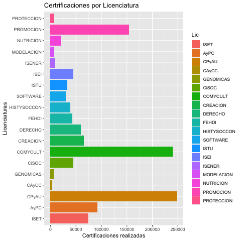

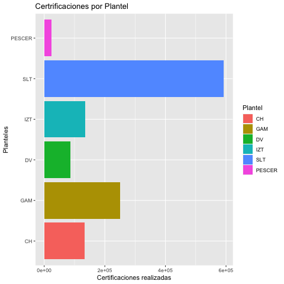


## Gráficas de Certificaciones por Planteles


## Graficas de Certificaciones por Año


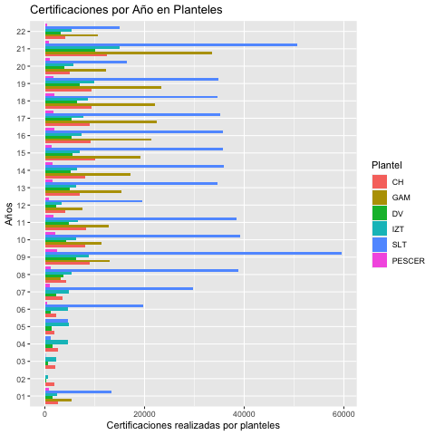
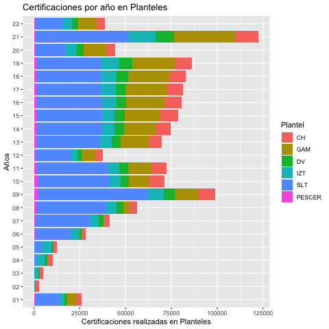

## Graficas de Certificaciones por Generacion

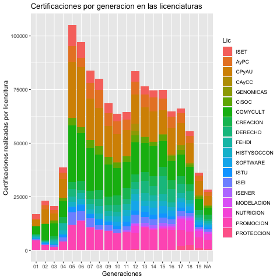


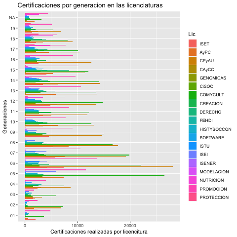


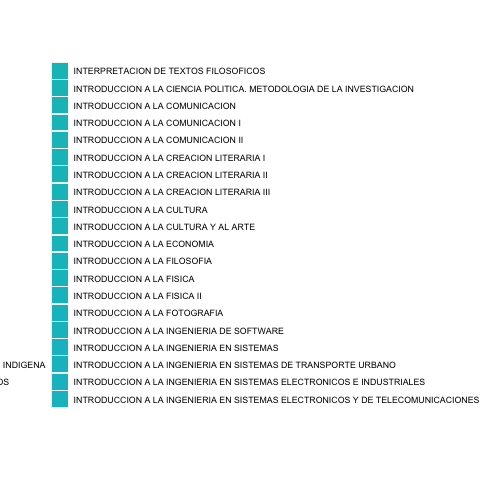


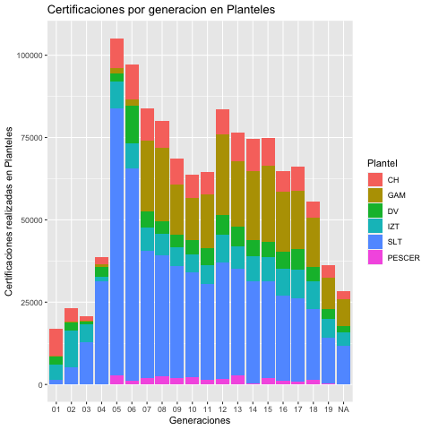


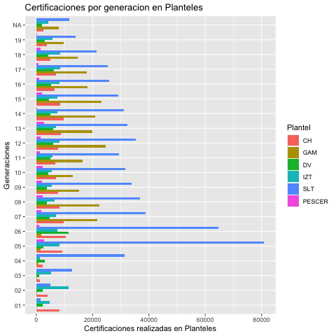
## Gráficas de certificaciones relacionadas con Licenciaturas

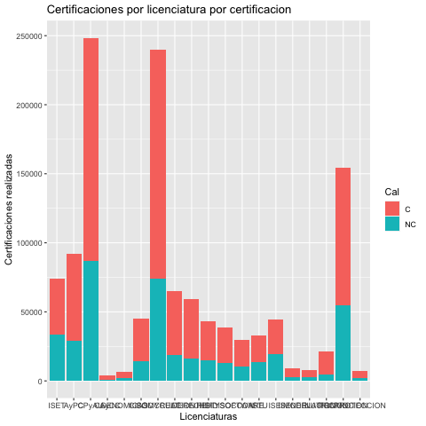


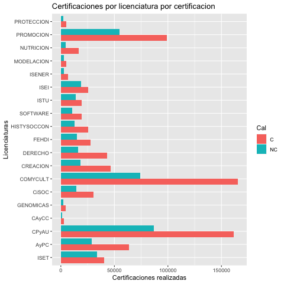


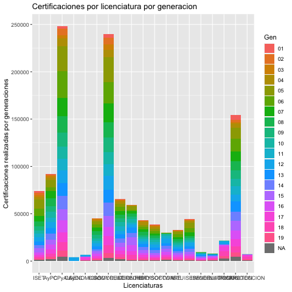


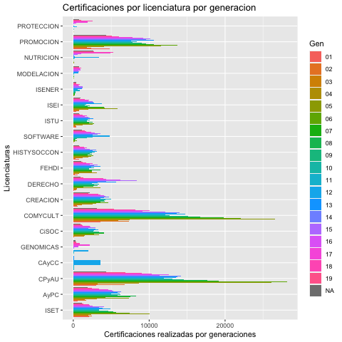


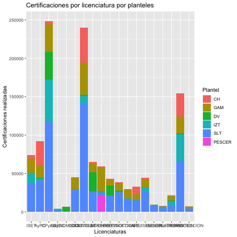


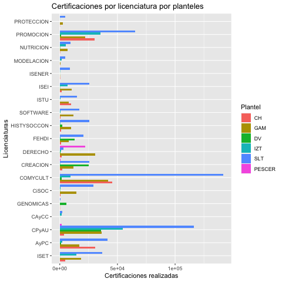
## Gráficas de Certificacines por Materias


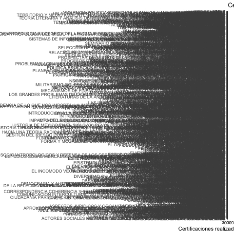


## Graficas de certificaciones por Plantel


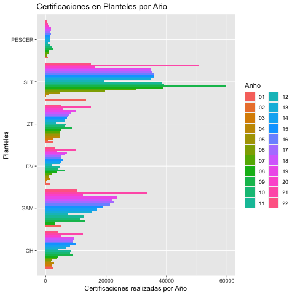


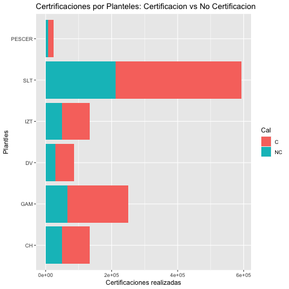

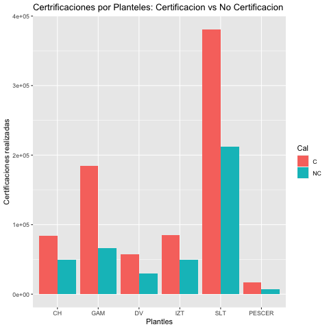
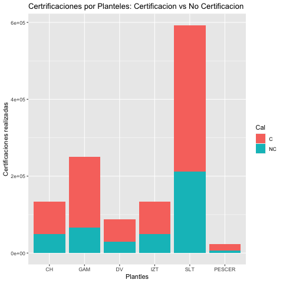


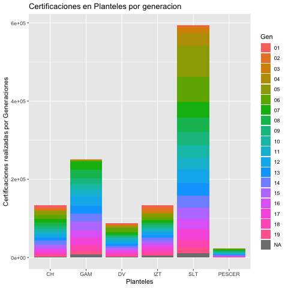

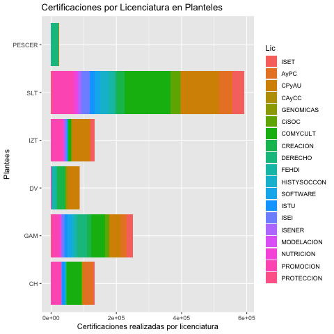

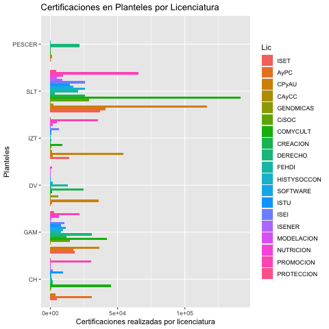

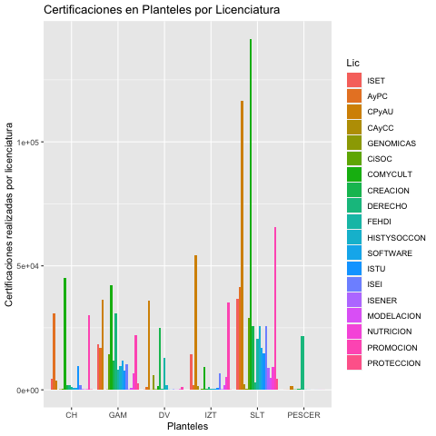


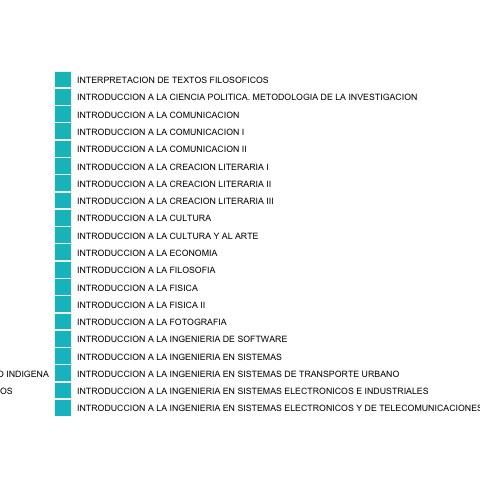


## Listado

```{r}
## 1                     BarPlotLic.png ya
## 2              BarplotPlantelCal.png ya
## 3               barplotPlanteles.png ya
## 4              BarplotPlantelGen.png ya
## 5              BarplotPlantelLic.png ya
## 6              ggplotBarplotAnho.png ya
## 7           ggplotBarplotAnhoLic.png ya
## 8          ggplotBarplotAnhoLic2.png ya
## 9      ggplotBarplotAnhoMaterias.png ya
## 10    ggplotBarplotAnhoMaterias2.png ya
## 11      ggplotBarplotAnhoPlantel.png ya
## 12     ggplotBarplotAnhoPlantel2.png ya
## 13     ggplotBarplotAnhoPlantel3.png ya
## 14           ggplotBarplotGenLic.png ya
## 15          ggplotBarplotGenLic2.png ya
## 16      ggplotBarplotGenMaterias.png ya
## 17       ggplotBarplotGenPlantel.png ya
## 18      ggplotBarplotGenPlantel2.png ya
## 19              ggplotBarplotLic.png ya
## 20           ggplotBarplotLicCal.png ya
## 21          ggplotBarplotLicCal2.png ya
## 22           ggplotBarplotLicGen.png ya
## 23          ggplotBarplotLicGen2.png ya
## 24       ggplotBarplotLicPlantel.png ya
## 25      ggplotBarplotLicPlantel2.png ya
## 26  ggplotBarplotMateriasPlantel.png ya
## 27 ggplotBarplotMateriasPlantel2.png ya
## 28 ggplotBarplotMateriasPlantel3.png ya
## 29      ggplotBarplotPlantelAnho.png ya
## 30       ggplotBarplotPlantelCal.png ya
## 31      ggplotBarplotPlantelCal2.png ya
## 32      ggplotBarplotPlantelCal3.png ya
## 33        ggplotBarplotPlanteles.png ya
## 34      ggplotBarplotPlantelGen3.png ya
## 35      ggplotBarplotPlantelGen4.png ya 
## 36       ggplotBarplotPlantelLic.png ya
## 37      ggplotBarplotPlantelLic2.png ya
## 38      ggplotBarplotPlantelLic3.png ya
## 39  ggplotBarplotPlantelMaterias.png ya
## 40 ggplotBarplotPlantelMaterias2.png ya 
## 41 ggplotBarplotPlantelMaterias3.png ya
```

# Tablas

```{r, echo=FALSE}
library(kableExtra)

# Crear los datos
data <- data.frame(
  Año1 = c(01, 02, 03, 04, 05, 06, 07, 08, 09, 10, 11),
  Cantidad1 = c(26173, 2927, 5109, 10144, 12565, 28147, 41332, 56299, 99032, 71193, 72554),
  Año2 = c(12, 13, 14, 15, 16, 17, 18, 19, 20, 21, 22),
  Cantidad2 = c(3774, 69575, 74449, 78721, 80783, 81429, 82974, 86330, 44395, 122594, 38627)
)

# Crear la tabla
kable(data, "html", booktabs = TRUE, caption = "Número de certificaciones por año en toda la Universidad.") %>%
  kable_styling("striped", full_width = FALSE) %>%
  column_spec(1, bold = TRUE) %>%
  column_spec(3, bold = TRUE)
```


```{r, echo=FALSE}
# Datos de la tabla
datos1 <- data.frame(
  Planteles = c("CH", "GAM", "DV", "IZT", "SLT", "PESCER"),
  `01` = c(8263, 146, 2321, 4707, 1430, 0),
  `02` = c(4132, 326, 2328, 11398, 5101, 0),
  `03` = c(1235, 241, 1006, 5370, 12801, 0),
  `04` = c(2173, 697, 3130, 1191, 31416, 0),
  `05` = c(9193, 1476, 2647, 8157, 80933, 2794),
  `06` = c(10566, 1852, 11588, 7523, 64603, 1029),
  `07` = c(9718, 21549, 4843, 7076, 38846, 1844),
  `08` = c(8183, 22348, 3749, 6545, 36801, 2399),
  `09` = c(7756, 15305, 3881, 5612, 33917, 2020),
  `10` = c(7005, 12963, 4311, 5406, 31698, 2342)
)

datos2 <- data.frame(
  Planteles = c("CH", "GAM", "DV", "IZT", "SLT", "PESCER"),
  `11` = c(6653, 16435, 5044, 5656, 29265, 1368),
  `12` = c(7688, 24588, 5988, 8342, 35439, 1615),
  `13` = c(8749, 19903, 6007, 6911, 32264, 2750),
  `14` = c(9753, 20987, 4963, 7590, 31143, 217),
  `15` = c(8400, 23058, 4558, 7571, 29166, 2071),
  `16` = c(6383, 18276, 5165, 8166, 25932, 1011),
  `17` = c(7120, 17947, 6180, 8601, 25392, 825),
  `18` = c(4928, 14830, 4321, 8548, 21391, 1474),
  `19` = c(3727, 9678, 2962, 5775, 13907, 206)
)

# Generar la tabla 01-10
cat("### Tabla 01-10\n")
knitr::kable(datos1, format = "markdown", booktabs = TRUE, caption ='')

# Generar la tabla 11-19
cat("### Tabla 11-19\n")
knitr::kable(datos2, format = "markdown", booktabs = TRUE, caption = "\\label{CertificacionesAnualPlanteles11-19}Número de certificaciones por año por planteles en toda la Universidad (11-19).")
```

```{r, echo=FALSE}


```


```{r, echo=FALSE}


```


```{r, echo=FALSE}


```


```{r, echo=FALSE}


```


```{r, echo=FALSE}


```


```{r, echo=FALSE}


```


```{r, echo=FALSE}


```


```{r, echo=FALSE}


```


```{r, echo=FALSE}


```


```{r, echo=FALSE}


```


