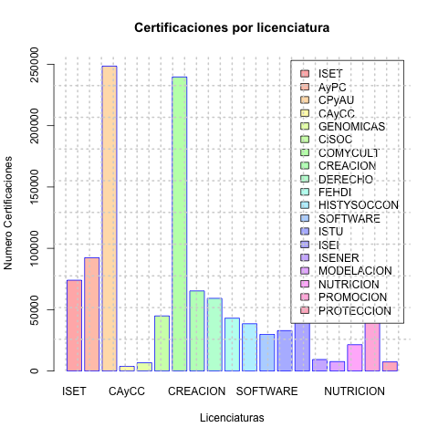
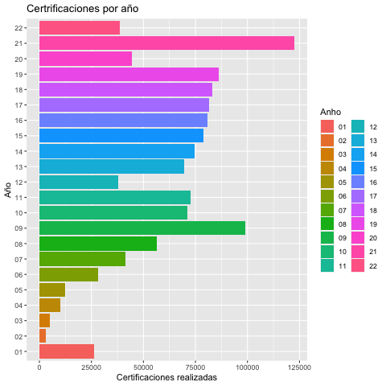
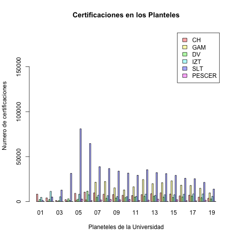
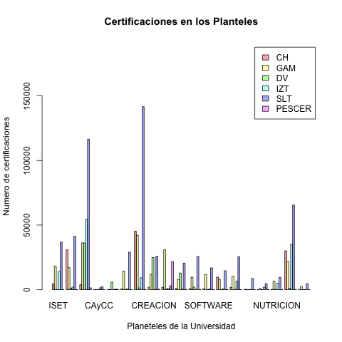
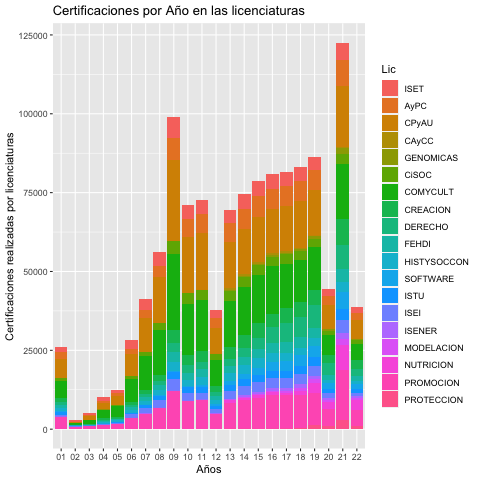
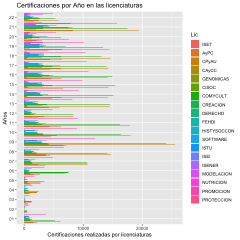
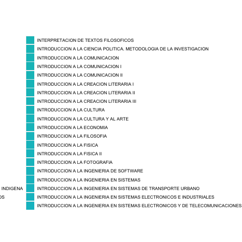
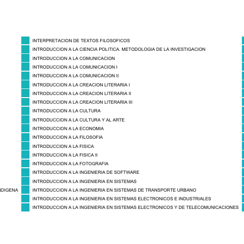
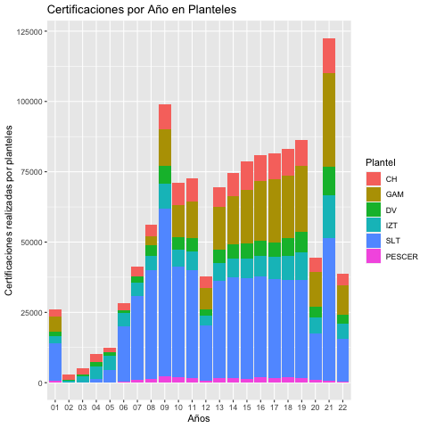

```{r setup, include=FALSE}
knitr::opts_chunk$set(echo = TRUE)
library(rmarkdown)
library(knitr)
```


# Presentación

Los gráficos generados son: 

```{r, echo = FALSE}
setwd("~/Desktop/MiGithub/ProyectoCertificacion/Graficas")
carpeta_png <- "~/Desktop/MiGithub/ProyectoCertificacion/Graficas"

archivos_png <- list.files(carpeta_png, pattern = ".png", full.names = TRUE)
#print(archivos_png)
nombres_archivos_png <- basename(archivos_png)

# Imprimir los nombres de los archivos PNG
#print(nombres_archivos_png)

archivos_png <- as.data.frame(nombres_archivos_png); print(archivos_png)
```

# Gráficas Generales







# Gráficas relacionadas con Planteles








# Graficas de Certificaciones por Año












```{r}
## 1                     BarPlotLic.png ya
## 2              BarplotPlantelCal.png ya
## 3               barplotPlanteles.png ya
## 4              BarplotPlantelGen.png ya
## 5              BarplotPlantelLic.png ya
## 6              ggplotBarplotAnho.png ya
## 7           ggplotBarplotAnhoLic.png ya
## 8          ggplotBarplotAnhoLic2.png ya
## 9      ggplotBarplotAnhoMaterias.png ya
## 10    ggplotBarplotAnhoMaterias2.png ya
## 11      ggplotBarplotAnhoPlantel.png
## 12     ggplotBarplotAnhoPlantel2.png
## 13     ggplotBarplotAnhoPlantel3.png
## 14           ggplotBarplotGenLic.png
## 15          ggplotBarplotGenLic2.png
## 16      ggplotBarplotGenMaterias.png
## 17       ggplotBarplotGenPlantel.png
## 18      ggplotBarplotGenPlantel2.png
## 19              ggplotBarplotLic.png
## 20           ggplotBarplotLicCal.png
## 21          ggplotBarplotLicCal2.png
## 22           ggplotBarplotLicGen.png
## 23          ggplotBarplotLicGen2.png
## 24       ggplotBarplotLicPlantel.png
## 25      ggplotBarplotLicPlantel2.png
## 26  ggplotBarplotMateriasPlantel.png
## 27 ggplotBarplotMateriasPlantel2.png
## 28 ggplotBarplotMateriasPlantel3.png
## 29      ggplotBarplotPlantelAnho.png
## 30       ggplotBarplotPlantelCal.png
## 31      ggplotBarplotPlantelCal2.png
## 32      ggplotBarplotPlantelCal3.png
## 33        ggplotBarplotPlanteles.png
## 34      ggplotBarplotPlantelGen3.png
## 35      ggplotBarplotPlantelGen4.png
## 36       ggplotBarplotPlantelLic.png
## 37      ggplotBarplotPlantelLic2.png
## 38      ggplotBarplotPlantelLic3.png
## 39  ggplotBarplotPlantelMaterias.png
## 40 ggplotBarplotPlantelMaterias2.png
## 41 ggplotBarplotPlantelMaterias3.png
```

