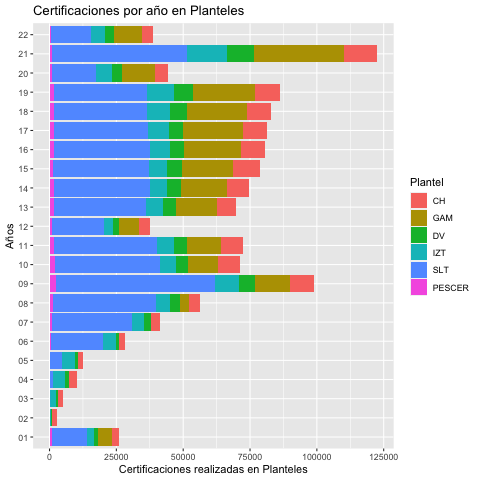
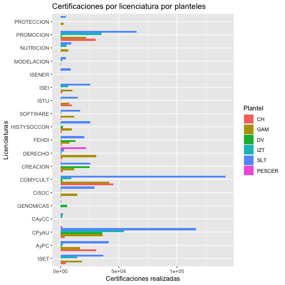
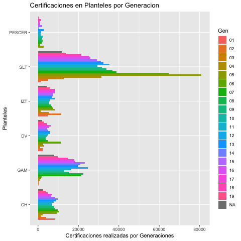
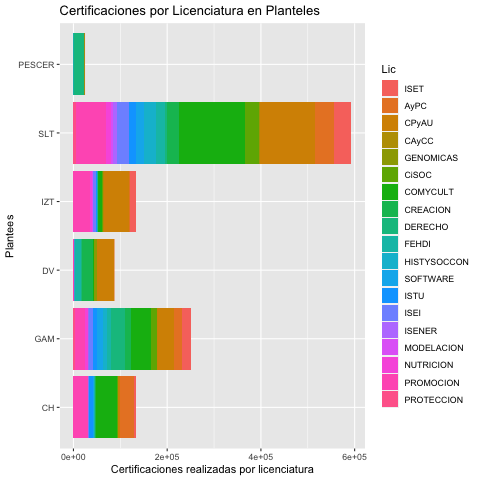
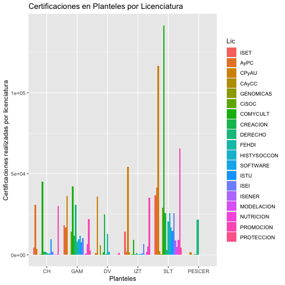

```{r setup, include=FALSE}
knitr::opts_chunk$set(echo = TRUE)
library(rmarkdown)
library(knitr)

```


# Presentación


\section{ Gráficas}

\subsection{Gráficas por Licenciaturas}


{ width=200 }

{ width=200 }

Las licenciaturas con mayor número de solicitudes de certificación son Ciencia Política y Comunicación y Cultura, es decir, tan solo estas dos asignaturas del Colegio de humanidades y ciencias sociales, lo cual reafirma que este colegio es sin lugar a dudas el más importante, la siguiente licenciatura con mayor número de certificaciones es Promoción de la Salud; en cuarto lugar la licenciatura con más certificaciones es Arte y Patrimonio, seguida de Ingenieria en Sistemas electrónicos y Telecomunicaciones


\subsection{Certificaciones por Planteles}


{ width=200 }


{ width=200 } 

El plantel con el más grande número de certificicaciones presentadas es el de San Lorenzo Tezonco, seguido de Cuautepec; Iztapalapa y Centro Histórico cuentan con casi la misma cantidad de registros (Figura 3 y Figura 4), lo que resulta esperado pues SLT y Cuautepec son los planteles que reciben más estudiantes que el resto de los Planteles, además de que los Planteles Casa Libertad y Centro histórico fueron de los primeros en abrir sus aulas y de que la oferta académica no es tan variada y abundante en comparación con los dos planteles mencionados. Una mención importante es el Plantel Del Valle pues debido a su tamaño, su ingreso anual se ve restringido a la disponibilidad de espacio y difícilmente será posible incrementarla en el mediano plazo.

\subsection{Certificaciones por año}

{ width=200 } 

La certificación en la Universidad, en sus primeros años tuvo un crecimiento gradual y sostenido, teniendo su valor más alto antes de la pandemia en el 2009, incluso las cifras del 2001 (año en que se inaugura la Universidad de la Ciudad de México) fueron más grandes a las obtenidas en los siguientes tres años, lo cual a reserva de estudiar los datos de ingreso a la Universidad se podría considerar que los primeros cuatro años fueron de consolidación del Proyecto educativo. 

También se puede observar que a partir del 2005 (año en que se otorga la autonomía) las certificaciones vuelven a tener un crecimiento sostenido, incluso con valores que en once años no se pudieron replicar. En el 2009 la Universidad ya contaba con un organo transitorio de gobierno, Consejo General Interno, que junto con la Rectoría y el Consejo Asesor se encargaban de tomar decisiones academicas y académico-administrativas con la finalidad de fortalecer y consolidar a la Universidad, acciones tales como aprobación de nuevas licenciaturas, aprobación de reglamentos y normas internas (Norma 1, Norma 2, Norma 3 y Norma 4, otro tipo de normas administrativas). En el año 2010 ya se contaba con el Consejo Universitario y nuevamente se da un gran salto aprobando reglamentos y Estatutos, pero sobre todo nuevas licenciaturas y posgrados. En este sentido se puede pensar que es en el 2009, 2010 y 2011 fueron años en que la población de la Ciudad de México reafirma su confianza en la Universidad y su población comienza a certificar sus conocimientos obtenidos en el aula o a través de trabajo independiente. 

El 2012 es un año complicado por el paro de actividades en la Universidad por casi seis meses, sin embargo en el 2013 y los años siguientes la Universidad retoma los niveles de certificacion, así como su crecimiento sostenido y gradual en toda la universidad hasta 2019, que es el año en que ocurre la pandemia en el mundo, y para México en el 2020.

A pesar de que las actividades académicas y académico-administrativas se retomaron gradualmente, las consecuencias de los efectos del COVID-19, en la población, las certificaciones fueron equivalentes a las realizadas en el año 2007. 

Una vez superada la primera ola y con la llegada de las vacunas, en el 2021 se obtuvieron la más grande cantidad de certificaciones, casi 125,000 certificaciones aplicadas, certificaciones todas en Línea, y con algunos cursos ya impartidos de manera presencial. 


En la Figura 7 se muestran las certificaciones en planteles por año, se puede observar que hay dos periodos en los que se puede observar que el Plantel San Lorenzo Tezonco tienen aproximadamente la misma cantidad de certificaciones aplicadas, el primer periodo es de 2008 a 2011, con excepción de 2009, y de 2010 a 2019, excepto 2012. Quien muestra un incremento en sus números es el Plantel Cuautepec principalmente, pero sin lugar a dudas quien presentó un aumento notable es PESCER.

{width=350}

\subsection{Gráficas de Certificaciones por Planteles}

La cantidad de certificaciones favorables son mayores a las no favorables en todos los plantleles

La certificación en Planteles como ya se mencionó antes en San Lorenzo Tezonco supera a los demás planteles (Figura 6), con excepción de Centro Histórico, la certificación favorable duplica a las no favorables

{width=350}


\subsection{Gráficas de Certificaciones por Generacion}

En la Figura 8 se muestran las certificaciones por licenciatura considerando las generaciones 2001 a 2019, mientras que en la figura 9 se muestran las certificaciones en planteles por generación. 

{width=350}


{width=350}

En este gráfico podemos corroborar que el Plantel Cuautepec es quien muestra un incremento en sus certificaciones, por generación, incluso se puede apreciar un decaimiento en los números del Plantel San Lorenzo Tezonco, es importante observar que para el Plantel Centro Histrórico en el periodo de 2012 a 2018 la certificación muestra un ligero incremento con respecto a los años anteriores.

\subsection{Gráficas de certificaciones relacionadas con Licenciaturas}



## Gráficas de Certificacines por Materias


## Graficas de certificaciones por Plantel









## Listado

```{r}
## 1                     BarPlotLic.png ya
## 2              BarplotPlantelCal.png ya
## 3               barplotPlanteles.png ya
## 4              BarplotPlantelGen.png ya
## 5              BarplotPlantelLic.png ya
## 6              ggplotBarplotAnho.png ya
## 7           ggplotBarplotAnhoLic.png ya
## 8          ggplotBarplotAnhoLic2.png ya
## 9      ggplotBarplotAnhoMaterias.png ya
## 10    ggplotBarplotAnhoMaterias2.png ya
## 11      ggplotBarplotAnhoPlantel.png ya
## 12     ggplotBarplotAnhoPlantel2.png ya
## 13     ggplotBarplotAnhoPlantel3.png ya
## 14           ggplotBarplotGenLic.png ya
## 15          ggplotBarplotGenLic2.png ya
## 16      ggplotBarplotGenMaterias.png ya
## 17       ggplotBarplotGenPlantel.png ya
## 18      ggplotBarplotGenPlantel2.png ya
## 19              ggplotBarplotLic.png ya
## 20           ggplotBarplotLicCal.png ya
## 21          ggplotBarplotLicCal2.png ya
## 22           ggplotBarplotLicGen.png ya
## 23          ggplotBarplotLicGen2.png ya
## 24       ggplotBarplotLicPlantel.png ya
## 25      ggplotBarplotLicPlantel2.png ya
## 26  ggplotBarplotMateriasPlantel.png ya
## 27 ggplotBarplotMateriasPlantel2.png ya
## 28 ggplotBarplotMateriasPlantel3.png ya
## 29      ggplotBarplotPlantelAnho.png ya
## 30       ggplotBarplotPlantelCal.png ya
## 31      ggplotBarplotPlantelCal2.png ya
## 32      ggplotBarplotPlantelCal3.png ya
## 33        ggplotBarplotPlanteles.png ya
## 34      ggplotBarplotPlantelGen3.png ya
## 35      ggplotBarplotPlantelGen4.png ya 
## 36       ggplotBarplotPlantelLic.png ya
## 37      ggplotBarplotPlantelLic2.png ya
## 38      ggplotBarplotPlantelLic3.png ya
## 39  ggplotBarplotPlantelMaterias.png ya
## 40 ggplotBarplotPlantelMaterias2.png ya 
## 41 ggplotBarplotPlantelMaterias3.png ya
```

# Tablas
